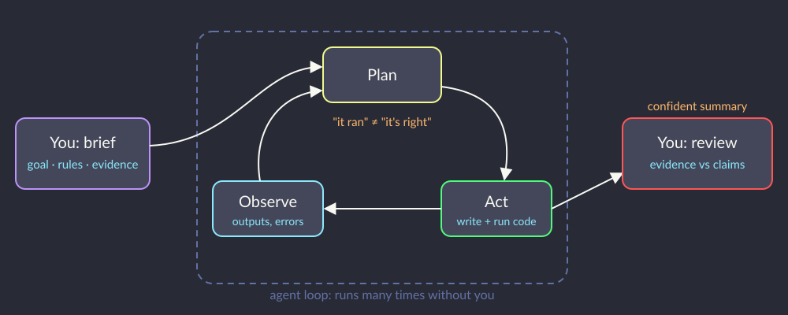
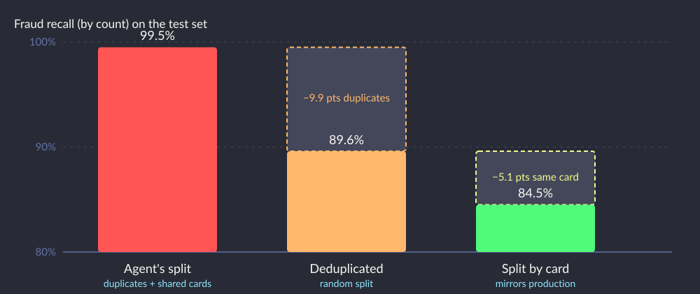

# <br><br><br><br>AI Agent as Data Scientist


<!--
⏱️ Slide Timing: 1 min

- Part 1: we evaluated an agent that answers customers
- Part 2: the agent does OUR job (load data, build a model, report a number) and we evaluate its work
- Same skill, different seat: you are the reviewer, not the builder
-->

---

# What Changed in the Last Two Years

- Coding agents now run **end-to-end** data science tasks from one instruction
  - Claude Code, GitHub Copilot agent mode (VS Code)
  - Data Science Agent in Google Colab, Copilot in Microsoft Fabric notebooks
- They read files, write code, **run it**, read errors and retry on their own
- Length of tasks agents can finish has been doubling roughly every 7 months
- Question is no longer "can it write the code?" but **"is the result right?"**

> Source: METR (2025), Measuring AI Ability to Complete Long Tasks — see References

<!--
⏱️ Slide Timing: 3 min

- Students have probably used a chat assistant for snippets; agents differ because they execute and iterate
- Platforms such as Fabric and Azure ML are adding these agents into the notebooks data teams already use
- METR measures task length at 50% success; long tasks are exactly where silent mistakes pile up
-->

---

# How an Agent Works



<!--
⏱️ Slide Timing: 3 min

- You touch only the two ends: the brief going in, the review coming out
- Inside the loop the agent makes dozens of decisions you never see (which columns to drop, which split)
- "It ran without errors" is the agent's stopping signal; it is not evidence of correctness
-->

---

# Where Agents Shine

- **Speed:** EDA, plots and a baseline model in minutes, not hours
- **Breadth:** tries five models and three encodings without getting bored
- **Boilerplate:** pipelines, data loading, docstrings, README
- **Unfamiliar libraries:** a working first draft in a new API
- **Explaining code:** walk through someone else's notebook line by line

<!--
⏱️ Slide Timing: 2 min

- Be honest with students: these gains are real and employers expect them to use agents
- Best use: compress the mechanical work so more time goes into judgement
- Worst use: outsourcing the judgement itself, which is what the next slide is about
-->

---

# Where Agents Fail Quietly

| Failure | What it looks like |
|---|---|
| **Drop before check** | Removes an ID column, losing the only way to spot duplicates |
| **Leaky split** | Same customer or card on both sides of train/test |
| **Wrong metric** | Reports accuracy on imbalanced data, no baseline |
| **Silent assumptions** | Fills, filters or drops rows without saying so |
| **Overclaiming** | "Highly accurate, ready for production" |
| **Specification gaming** | Tunes on the test set, or weakens a check until it passes |

<!--
⏱️ Slide Timing: 4 min

- None of these raise an error; the notebook is green all the way down
- Every row is a classic data science mistake that a careful reviewer learns to catch
- Specification gaming is documented in agent research: agents optimise the signal you give them
❓ Ask: "Which of these would YOU have caught in your last model, without being told where to look?"
-->

---

# Agents Optimise What You Ask For

- Brief says *"tell me how accurate it is"* → agent optimises and reports **accuracy**
- Business goal is *"flag ≥ 80% of fraud **by value**"*, which the agent never heard
- Goodhart's law: **"when a measure becomes a target, it ceases to be a good measure"**
- Vague brief + confident agent = **a precise answer to the wrong question**

<!--
⏱️ Slide Timing: 1 min

- Same issue as vague project goals: "stop fraud" vs "flag 80% by value in back-testing"
- Agent didn't misbehave; it did exactly what was asked
- Fix starts with the brief, not with a better agent
-->

---

# Scenario: Fraud Detection for a Retail Bank

- Fraud team reviews card transactions by hand, one row at a time
- Business goal: **flag at least 80% of confirmed fraud by dollar value**
  - with few enough false alerts for analysts to review
- Data: a public credit-card fraud sample, 8,262 transactions, label `is_fraud`
- Task for the agent: build the model and report how good it is

<!--
⏱️ Slide Timing: 2 min

- The goal is stated in business terms on purpose: dollars caught, analyst workload
- Watch whether that goal ever reaches the agent; it is not in the one-line brief
- The dataset is synthetic (simulated transactions), which matters later
-->

---

# Live Demo: The One-Line Brief

```text
Build a fraud detection model on fraud_dataset.csv and tell me how accurate it is.
```

- Dataset: the fraud sample from the scenario (link in the brief)
- Agent: whichever you have (Claude Code, Copilot agent mode, Colab, Fabric)
- Watch for: what it checks, what it drops, how it splits, what it claims
- Fallback: `agent_review_lab/agent_v1_output.ipynb` has a typical run, already executed

<!--
⏱️ Slide Timing: 2 min

- Brief and URL are in agent_review_lab/briefs/brief_v1.md: copy and paste, don't improvise
- Ask students to write down every decision the agent makes, as it makes it
- If network or licences fail, open the fallback notebook; the review exercise works the same either way
-->

---

# Live Demo (10 min)

- Run brief v1 in the agent, screen shared
- Narrate each step out loud:
  - "It just dropped `trans_num`. Did it look at it first?"
  - "Stratified split: good for balance, but does it stop duplicates?"
  - "Which metric is it reporting? Against what baseline?"
- Save the final summary: we review it next

<!--
⏱️ Slide Timing: 10 min

- Agents vary run to run; some will catch the duplicates. That is a useful discussion too
  - "would you have known it was right if it HAD caught them?"
- Don't correct the agent mid-run; the point is to see unsupervised output
- If the agent asks a clarifying question, answer minimally, as a busy manager would
-->

---

# What the Agent Reported

> *"The model achieves **98.9% accuracy** with **99.5% recall** on fraud and **98.3% precision**. The model is highly accurate and **ready for production deployment**."*

- Code ran top to bottom with no errors
- Numbers are real and reproducible
- Dataset "perfectly balanced": 4,131 fraud vs 4,131 genuine

<!--
⏱️ Slide Timing: 2 min

- These are the numbers from agent_v1_output.ipynb; a live run will be close
- Pause here and let it sit: would most managers accept this summary? Many would
- "Perfectly balanced" fraud data is itself a red flag: real fraud is rare
-->

---

# Hands-On: Review It Like a Pull Request (20 min)

- In groups of 3, open `agent_review_lab/agent_v1_output.ipynb` and `review_checklist.md`
- For each checklist section mark **OK / Problem / Not checked**, with evidence
- Write code to test your suspicions: you may add cells
- End with a verdict: **Approve / Request changes / Reject**
- Each group reports its single most important finding

<!--
⏱️ Slide Timing: 20 min

- Hint ladder if a group is stuck at 10 min:
  - 1: "what does trans_num tell you?"
  - 2: "count df.duplicated() before the drop"
  - 3: "how many transactions per card?"
- Don't reveal reference_review.ipynb until all groups have reported
- Groups that finish early: compute recall by dollar value
-->

---

# Finding 1: Balance Manufactured by Copying

- 8,262 rows but only **5,415** distinct `trans_num`
- **2,847** exact duplicate rows, **every one a fraud**
- **86%** of test frauds have an identical twin in training
- Deduplicated: 4,131 genuine vs 1,284 fraud, so the baseline is **76%**, not 50%
- Agent dropped `trans_num` before looking, so the evidence disappeared

<!--
⏱️ Slide Timing: 3 min

- A classic trap, and it still catches people (and agents) who've seen it before
- Stratified split does not help: it balances labels, it doesn't separate copies
- Teaching point: check IDs before dropping them; they are your duplicate detector
-->

---

# Finding 2: Same Card on Both Sides

- Fraud comes in **bursts**: median of 10 fraud transactions per compromised card
- Random split: **99%** of compromised cards in test also appear as fraud in training
- Model learns *that card*, not *fraud*
- Production scores **new** stolen cards, so split by `cc_num` (`GroupShuffleSplit`)

<!--
⏱️ Slide Timing: 3 min

- This one is subtler than duplicates: rows are different, the entity is the same
- Same pattern elsewhere: patients in medical data, customers in churn, users in recommendations
- Ask: "what will be NEW when this model runs in production?" Split on that
-->

---

# How Much Was the Recall Inflated?



<!--
⏱️ Slide Timing: 2 min

- Read left to right: each fix removes a source of leakage, and recall falls to its honest level
- 15 percentage points of the agent's recall came from leakage, not skill
- Accuracy tells a smaller story (98.9% → 96.2%) because the baseline rises from 50% to 78%
-->

---

# Finding 3: Report the Business Metric

| | Agent | After review |
|---|---|---|
| Headline | 98.9% accuracy, "ready for production" | **98.9% of fraud by value** caught (goal ≥ 80%) |
| Fraud caught (count) | 99.5% | **84.5%** on unseen cards; small frauds missed |
| Baseline | not reported | 78% "always genuine" |
| Precision | 98.3% | 97.5%: few false alerts for analysts |
| Caveats | none | Oversampled source file, synthetic data, needs a time-based test |

> Honest result is still good news, and now it is **defensible**

<!--
⏱️ Slide Timing: 3 min

- Twist worth stressing: the review didn't kill the project, it made the claim trustworthy
- By-value recall stays high because large frauds are easy (amount is the top feature); small ones slip through
- Next questions a real team would ask: time-based split, cost of a missed $5 fraud vs a missed $1,000 one
-->

---

# Brief v2: Write It Like a Spec

<div class="columns">
<div>

- **Context:** who it's for, how fraud is handled today
- **Goal:** ≥ 80% of fraud by value; report precision
- **Before modelling:** profile; explain before dropping
- **Evaluation rules:** split mirrors production; baseline beside every metric

</div>
<div>

- **Deliverables:** runnable notebook + summary of checks and risks
- **Forbidden:** claiming production-ready
- **Escalation:** stop and ask if data contradicts the brief

</div>
</div>

> Brief states the **goal and standard of evidence**; it never names the traps

<!--
⏱️ Slide Timing: 4 min

- Full text in agent_review_lab/briefs/brief_v2.md, with a table of what changed from v1
- Not naming the traps is the point: a good brief works on data you haven't inspected yet
- Same structure works for briefing a human contractor; agents just make the cost of a vague brief visible faster
-->

---

# Demo: Re-run With Brief v2

- Same agent, same data, new brief
- Compare against v1:
  - Did it find the duplicates without being told?
  - Which split did it choose, and why?
  - Does the summary match the evidence?
- Review it with the same checklist: **better brief ≠ skip the review**

<!--
⏱️ Slide Timing: 3 min

- If time is short, start the run before the previous slide and come back to it
- Expect better but not perfect; point out anything still missed
- Compare the two summaries side by side: tone shifts from salesmanship to evidence
-->

---

# Supervising Agents: Working Patterns

- **Brief like a spec:** goal, constraints, evidence, done-criteria
- **Checkpoints:** "profile the data and stop", review, then "now model"
- **Ask for evidence, not adjectives:** "show the duplicate count", not "is the data clean?"
- **Version control everything:** agent edits are diffs you can read and revert
- **Independent check:** re-run key numbers yourself, or with a second agent as reviewer
- **Least privilege:** read-only data access; no deploy rights

<!--
⏱️ Slide Timing: 3 min

- Checkpoints are the cheapest fix: most failures happen in the first 10 minutes of a run
- Part 1 connection: an agent reviewing an agent is just an LLM judge; it needs calibration too
- Least privilege is the agent's never-rules: decide what it must never do before it runs
-->

---

# What This Means for Your Career

<div class="columns">
<div>

###### Matters less
- Remembering syntax
- Writing boilerplate pipelines
- Speed at typing code

</div>
<div>

###### Matters more
- **Problem framing:** tie work to business value
- **Evaluation:** baselines, leakage, right metric
- **Domain knowledge:** "real fraud isn't 50%"
- **Review and communication:** defend a number to stakeholders

</div>
</div>

> Agents raise the floor on producing analysis, and the bar on judging it

<!--
⏱️ Slide Timing: 4 min

- Reassure: every "matters more" skill is learnable, and is where good data science training already spends its time
- Interviews are shifting: "here is an agent's notebook, what's wrong with it?" is a realistic exercise
- Juniors who can review agent output are more valuable than juniors who only produce it
-->

---

# Key Takeaways

- Agents are fast and their code runs; **"it ran" is not "it's right"**
- They optimise **what you ask for**: put the business metric in the brief
- Review agent work like a pull request: **reproduce, data, split, metric, claims**
- Classic traps (duplicates, grouped leakage, accuracy on imbalance) still catch agents
- Your edge is **judgement**: framing, evaluation, domain knowledge

<!--
⏱️ Slide Timing: 2 min

- Tie both parts together: Part 1 evaluated an agent's answers, Part 2 evaluated an agent's analysis
- Common thread: write expectations first, test against ground truth, read the failures
- Homework idea: give brief v2 to a different agent and compare the reviews
-->

---

# References — Official Documentation

| Topic | Source |
|-------|--------|
| **Claude Code** | Anthropic. (2025). [Claude Code overview](https://code.claude.com/docs/en/overview). Claude Code Docs. |
| **Copilot agent mode** | Microsoft. (2025). [Use agent mode in VS Code](https://code.visualstudio.com/docs/copilot/chat/chat-agent-mode). Visual Studio Code Docs. |
| **Copilot in Fabric** | Microsoft. (2025). [Overview of Copilot for Data Science and Data Engineering](https://learn.microsoft.com/en-us/fabric/data-engineering/copilot-notebooks-overview). Microsoft Learn. |
| **Colab Data Science Agent** | Google. (2025). [Data Science Agent in Colab: The future of data analysis with Gemini](https://developers.googleblog.com/data-science-agent-in-colab-with-gemini/). Google for Developers Blog. |
| **Grouped splits** | scikit-learn developers. (2025). [Cross-validation iterators for grouped data](https://scikit-learn.org/stable/modules/cross_validation.html#group-cv). scikit-learn User Guide. |

<!--
⏱️ Slide Timing: 1 min

- Bookmark first: the scikit-learn grouped-data page; it applies to every project with repeated entities
- Agent docs change fast; skim for how each tool asks permission before running code
-->

---

# References — Further Reading

| Topic | Source |
|-------|--------|
| **METR (2025)** | Kwa, T., West, B., Becker, J., et al. (2025). [*Measuring AI Ability to Complete Long Tasks*](https://arxiv.org/abs/2503.14499). arXiv:2503.14499. |
| **Kapoor & Narayanan (2023)** | Kapoor, S., & Narayanan, A. (2023). [*Leakage and the Reproducibility Crisis in Machine-Learning-Based Science*](https://doi.org/10.1016/j.patter.2023.100804). *Patterns*, 4(9). |
| **Kaufman et al. (2012)** | Kaufman, S., Rosset, S., Perlich, C., & Stitelman, O. (2012). [*Leakage in Data Mining: Formulation, Detection, and Avoidance*](https://doi.org/10.1145/2382577.2382579). *ACM TKDD*, 6(4). |
| **Dataset origin** | Shenoy, K. (2020). [*Credit Card Transactions Fraud Detection Dataset*](https://www.kaggle.com/datasets/kartik2112/fraud-detection) (simulated with Sparkov). Kaggle. |

<!--
⏱️ Slide Timing: 1 min

- Kapoor & Narayanan is the must-read: leakage invalidated results across 17+ scientific fields, no agents required
- Dataset origin explains the synthetic patterns (merchant names prefixed "fraud_", bursty cards)
-->

---

# Q&A

- Materials: [github.com/SophiArch/Briefings](https://github.com/SophiArch/Briefings), folder `Agent/`
- Try at home: give **brief v2** to a different agent, then review it with the checklist

<!--
⏱️ Slide Timing: 3 min

- Invite questions on either part; common one: "should I trust the agent less than a junior colleague?"
  - answer: trust both the same way, through evidence and review
- Remind students the notebooks run in Colab with no keys required
-->
