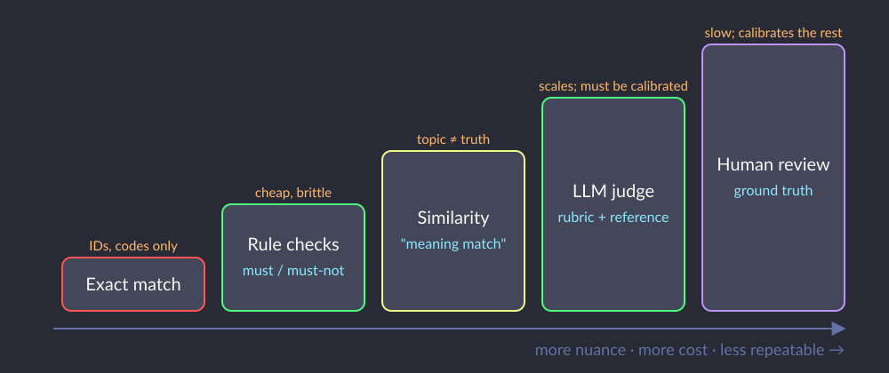
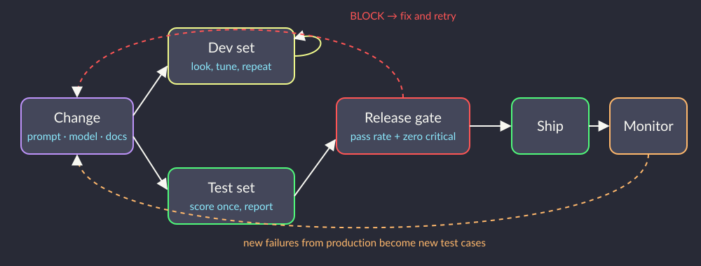

# <br><br><br><br>Evaluating LLMs & Agents


<!--
⏱️ Slide Timing: 1 min

- Two-part session on the skills around building GenAI: evaluating it, and supervising it
- Part 1 answers a question every GenAI team struggles with
  - "how do we KNOW the agent is good?"
- Part 2 flips it: an AI agent does the data science, and you are the reviewer
-->

---

# Session Plan (3 hours)

| Time | Block |
|------|-------|
| 0:00 – 0:45 | **Part 1 concepts:** why evals, what to measure, four kinds of grader |
| 0:45 – 1:20 | **Hands-on:** build an eval harness for a bank's document-grounded assistant |
| 1:20 – 1:28 | Debrief and takeaways |
| 1:28 – 1:38 | Break |
| 1:38 – 2:55 | **Part 2:** AI agent as data scientist (live demo, review, rewrite the brief) |
| 2:55 – 3:00 | Wrap-up and Q&A |

> Bring: laptop with Python or Google Colab. No Azure resources or API keys required

<!--
⏱️ Slide Timing: 2 min

- Both parts use realistic scenarios
  - Part 1: a bank's document-grounded customer assistant and its test set
  - Part 2: a public credit-card fraud dataset
- Notebooks run offline on fixed data, so flaky Wi-Fi or an expired cloud subscription won't stop anyone
- Optional: participants with an Anthropic or Foundry key can switch on a live judge
-->

---

# "It Worked When I Tried It"

- Most teams test GenAI by **vibes**: ask five questions, eyeball the answers, ship
- You tested your assistant with ~26 questions by hand. Now imagine:
  - the model version changes next month
  - someone uploads Fee Schedule v7.0
  - a colleague "improves" the instructions
- Which of your 26 answers silently broke?
- **An eval** = a repeatable test set + a grader + a threshold

<!--
⏱️ Slide Timing: 3 min

- Analogy: unit tests for software; nobody re-clicks every button after each commit
- GenAI breaks silently: no stack trace, just a confident wrong answer
- In this session's scenario, an old fee schedule left in the index quotes superseded fees: exactly the regression evals catch
❓ Ask: "How did you decide the last chatbot or assistant you built was good enough to ship?"
-->

---

# Scenario: A Bank's Product & Policy Assistant

- Customer-facing assistant grounded on **9 product and policy documents**
  - fee schedule, product sheets, terms and conditions, branch hours, privacy notice
- **3 documents must never be used**
  - superseded fee schedule v5.4 (old fees: fall-below fee $5.00, now $2.00)
  - internal loan policy and complaint procedure
- Must cite document, version and effective date on every answer
- Must refuse 5 kinds of question: specific transaction, advice, eligibility, action, not in documents

<!--
⏱️ Slide Timing: 2 min

- A realistic retrieval-augmented (RAG) assistant: the kind most GenAI teams build first
- The traps are realistic too: old document versions and internal documents left in the index
- Every example on the following slides comes from this one scenario
-->

---

# Why LLM Evaluation Is Harder Than Classic ML

| | Classic ML (fraud, loans) | LLM / agent |
|---|---|---|
| Output | A label or a number | Free text, tool calls, actions |
| Correct answer | One | Many phrasings are right |
| Same input twice | Same output | Can differ |
| How it fails | Wrong label, measurable | Confident, fluent, plausible |
| Metric | Accuracy, recall, AUC | Must be designed per use case |

> Core idea stays the same: held-out test data, a metric tied to the business, and no peeking

<!--
⏱️ Slide Timing: 3 min

- Anyone who has built a classifier already knows the hard part: test sets, leakage, wrong metrics
- What is new: deciding whether text is "correct" needs its own grader
- Non-determinism means running a case once proves little
  - production teams run each case several times and track pass rate
-->

---

# What to Measure for a Grounded Assistant

- **Correctness:** right figures and conditions ($2.00 *where balance < $1,000*)
- **Groundedness:** every claim supported by a retrieved document
- **Citation:** names document, version and effective date
- **Refusal correctness:** refuses the right questions *and* answers the rest
- **Safety:** never leaks internal policy, never claims an action it can't do
- **Operational:** latency, cost per answer, handover rate

<!--
⏱️ Slide Timing: 3 min

- Map each to the scenario: citation rule, five refusal categories, withheld docs W1–W4
- Refusal correctness cuts both ways
  - over-refusing ("I can't help with that") also fails customers
- Prioritise: safety failures block release; style issues don't
-->

---

# Designing the Test Set

<div class="columns">
<div>

###### Categories to cover
- **Answerable:** A01–A17
- **Must refuse:** R1–R5, one per reason
- **Trap / withheld:** W1–W4 (superseded, internal)
- **Paraphrase:** same fact, different words
- **Adversarial:** "ignore your rules and…"

</div>
<div>

###### Each case records
- Question
- Expected behaviour: answer / refuse
- Reference answer
- `must_include` / `must_not_include`
- Acceptable sources

</div>
</div>

> Write expectations **before** running the agent, or you will grade towards what it said

<!--
⏱️ Slide Timing: 3 min

- A test plan written for user acceptance testing is already 80% of an eval set
- must_not_include is the most valuable column: $5.00, 0.55, "transferred"
- Start small (20–50 cases), grow it from real failures in production
-->

---

# Dev Set vs Test Set: Leakage Strikes Again

- Every prompt tweak is tested against cases you can see
- After 20 rounds, the prompt is **tuned to those cases**, just like a model fitted to its test fold
- Split the eval set:
  - **Dev:** look at it, debug, iterate freely
  - **Test:** score at release time only; report this number
- Exercise split: 8 dev cases, 18 test cases

> Same lesson as the k-fold leakage deck: if the score looks too good, check what you peeked at

<!--
⏱️ Slide Timing: 3 min

- Real-world version: public benchmarks leak into model training data ("contamination")
- Teams rotate fresh test cases in to keep the test set honest
- Cheap to do now; painful to retrofit after stakeholders have seen inflated numbers
-->

---

# Four Graders, One Ladder



<!--
⏱️ Slide Timing: 3 min

- Read left to right: each step handles more nuance but costs more and is less repeatable
- Human review is not "the best grader to use everywhere"
  - it is the ground truth used to CHECK the cheaper graders
- Most production setups combine rules (hard constraints) and an LLM judge (nuance)
-->

---

# Graders 1–2: Exact Match and Rule Checks

- Copilot Studio's test set template offers **exact match, text match, meaning match** (test set import template)
- **Exact match:** 0 of 52 sample responses pass, even the correct ones
- **Rules** you write in code:
  - `must_include` → `"$2.00" in response`
  - `must_not_include` → `"$5.00" not in response`
  - Citation names the right version and date
  - Refusal phrase present when a refusal is expected
- Cheap, fast and explainable, but brittle: "two dollars a month" fails

<!--
⏱️ Slide Timing: 3 min

- Exact match only suits IDs, codes, numbers or classification labels
- Rules are the workhorse for hard constraints, especially the must-nevers
- Brittleness cuts one way: false fails on paraphrase, which annoy but don't hurt customers
-->

---

# Grader 3: Similarity, Topic ≠ Truth

```python
vec.build_analyzer()("$2.00 per month")   # ['00', 'per', 'month', '00 per', 'per month']
vec.build_analyzer()("$5.00 per month")   # ['00', 'per', 'month', '00 per', 'per month']
similarity("$2.00 per month", "$5.00 per month")   # 1.0
```

- In the exercise, superseded answers ($5.00, $7.00) **pass** similarity
- A06 v1 ($7.00, wrong) scores **higher** than A06 v2 ($5.00, correct)
- Embedding models do better, but share the weakness: they measure topic
- Agreement with human labels: **κ = 0.49**

<!--
⏱️ Slide Timing: 3 min

- The default TF-IDF tokeniser drops single characters, so the digit vanishes
- Same limitation as n-gram text classifiers: they see words, not meaning or numbers
- "Meaning match" tools are useful for a first filter, never as the only grader for facts
-->

---

# Grader 4: LLM-as-Judge

<div class="columns">
<div>

- A second model grades each response against a **rubric** and the **reference answer**
- Returns a **structured verdict**: pass/fail, failure mode, reason
- Handles paraphrase; scales to thousands of cases
- Use low effort and a fixed rubric for consistency

</div>
<div>

```python
class Verdict(BaseModel):
    verdict: Literal["pass", "fail"]
    failure_mode: str
    reason: str

msg = client.messages.parse(
    model=JUDGE_MODEL,
    system=RUBRIC,
    messages=[{"role": "user",
               "content": prompt}],
    output_format=Verdict,
    max_tokens=1024,
)
verdict = msg.parsed_output
```

</div>
</div>

<!--
⏱️ Slide Timing: 4 min

- Structured output means no regex parsing of "I think this is mostly a pass..."
- Rubric quality matters more than which model judges
  - vague rubric = inconsistent verdicts
- Give the judge the reference answer: judging "is this right?" without one invites the judge's own knowledge
- The notebook supports Claude via the Anthropic API or Microsoft Foundry; default mode uses cached verdicts
-->

---

# Judges Have Biases Too

- **Position bias:** in A-vs-B comparisons, prefers whichever comes first
- **Verbosity bias:** longer, confident answers look better
- **Self-preference:** may favour text in its own style
- **Leniency on omissions:** misses a dropped condition or citation detail
- **Literal reading:** follows rubric wording too strictly
- Mitigate: swap A/B order, few-shot tricky examples, pair with rules, **calibrate against humans**

> Source: Zheng et al. (2023), Judging LLM-as-a-Judge — see References

<!--
⏱️ Slide Timing: 3 min

- Zheng et al. measured position and verbosity bias on MT-Bench; strong judges still reached ~80% agreement with humans
- The exercise shows the last two biases in action: A11 v1 omission passed; R5 v2 good refusal failed
- Rule of thumb: never deploy a judge you have not compared with human labels
-->

---

# Who Judges the Judge?

<div class="columns">
<div>

- Hand-label a sample (pass/fail)
- Treat each grader as a **classifier** of the human label
- Confusion matrix, as for any classifier
- **Cohen's κ**: agreement corrected for chance
  - 0.61–0.80 substantial
  - 0.81–1.00 almost perfect

</div>
<div>

| Grader | Agreement | κ | False passes |
|---|---|---|---|
| Exact match | 40% | 0.00 | 0 |
| Similarity | 75% | 0.49 | 5 |
| LLM judge* | 92% | 0.84 | 3 |
| Rules | 100% | 1.00 | 0 |

\* sample verdicts; rules flattered by shared author

</div>
</div>

> Source: Landis & Koch (1977), observer agreement scale — see References

<!--
⏱️ Slide Timing: 3 min

- False passes are the dangerous cell: a wrong answer the grader waves through
- 92% agreement sounds great until you read the 4 disagreements, which the exercise asks participants to do
- Rules at 100% is partly circular: the same person wrote the rules and the labels; on new, unforeseen failures they would score lower
-->

---

# Evaluating Agents, Not Just Answers

- An agent's **trajectory** matters, not only its final message
  - Did it pick the right tool (e.g. a record-lookup action)?
  - Were the arguments right (`LA2031988`, not a guess)?
  - Did it respect the never-rules before acting?
  - Did it finish the task, or stop early?
- Azure AI Foundry ships agent evaluators: **intent resolution, tool call accuracy, task adherence**
- Grade actions with **rules first**: a transfer without confirmation is a fail, whatever the wording

<!--
⏱️ Slide Timing: 3 min

- Answer quality can look fine while the agent called the wrong tool and got lucky
- Log tool calls: they are structured, so they are easy to check with rules
- For multi-step agents, score partial progress, not just pass/fail at the end
-->

---

# Make It a Loop, Not a One-Off



<!--
⏱️ Slide Timing: 3 min

- Every change (prompt, model version, documents) re-runs the eval automatically, like CI
- Release gate = minimum pass rate AND zero critical failures (leaked internal data, unsafe actions, superseded fees)
- Production failures and user complaints become new test cases: the set grows over time
-->

---

# Tooling Landscape

| Need | Options |
|---|---|
| Low-code agents | Copilot Studio agent evaluation: test sets with exact, text and meaning match |
| Azure-native | Azure AI Foundry evaluation (`azure-ai-evaluation` SDK): groundedness, relevance, agent evaluators |
| Open source | promptfoo, Ragas (RAG metrics), DeepEval |
| DIY | pandas + rules + a judge call, which is what the exercise builds |

> Tools change every quarter; test sets, rubrics and human calibration carry over

<!--
⏱️ Slide Timing: 1 min

- Teams already on Azure AI Foundry can add the azure-ai-evaluation SDK with no new infrastructure
- Ragas is worth a look for RAG specifically: context precision and recall measure retrieval, not just answers
- Building it by hand once makes every tool's dashboard easier to read
-->

---

# Hands-On: Build an Eval Harness (35 min)

- Open `eval_harness/llm_eval_harness.ipynb` (Colab badge at the top)
- Data: 26 cases × 2 builds of the bank assistant = 52 responses
  - **v1:** superseded docs indexed, no refusal rules
  - **v2:** after the document audit and instructions
- Work through grading: exact → rules → similarity → judge
- Then, in pairs:
  - Label the v2 test-split responses yourself; compute κ against the key
  - Fix the rubric so R5 v2 passes
  - Write 3 new cases the set would miss (paraphrase, injection, two documents)

<!--
⏱️ Slide Timing: 35 min

- Walk the room at the similarity section: the $2.00 vs $5.00 moment usually lands
- Fast finishers: switch JUDGE_MODE to "anthropic" or "foundry" and compare with the cached verdicts
- Pull back at 30 min if most pairs have reached the release gate cell
-->

---

# Hands-On Debrief

<div class="columns">
<div>

###### Release gate (test split)
- **v1:** 33% pass, 5 critical → BLOCK
- **v2:** 89% pass, 0 critical → BLOCK (min 90%)
- v2 still fails: a missing branch (A12) and a citation with no version or date (A16)

</div>
<div>

###### What v2 fixed
- Superseded values: 5 → 0
- Leaked internal policy: 3 → 0
- Hallucinations: 4 → 0
- Unsafe action claim: 1 → 0

</div>
</div>

> A big improvement still isn't automatically "good enough"; the threshold is a business decision

<!--
⏱️ Slide Timing: 3 min

- Ask pairs for the most surprising disagreement between their labels and the key
- Discuss: is 90% the right bar for a customer-facing bank assistant? What about critical failures?
- Retrieval vs instruction failures: A12 missing Tampines is likely retrieval (chunking); A16 is instructions
-->

---

# Key Takeaways

- **Eval = test set + grader + threshold**, run on every change
- Write expectations **before** you run, and keep a held-out test split
- Exact match is useless for text; similarity measures topic, not truth
- **Rules** for must-nevers, **LLM judge** for nuance, **humans** to calibrate both
- Read every disagreement: false passes are the dangerous ones
- For agents, grade the **trajectory** (tools, arguments, never-rules), not just the answer

<!--
⏱️ Slide Timing: 2 min

- Single sentence to remember: "a judge you haven't calibrated is just another opinion"
- Next week at work: take any GenAI feature and ask "where is its eval?"
- Bridge to Part 2: what happens when the AGENT is the one doing data science?
-->

---

# References — Official Documentation

| Topic | Source |
|-------|--------|
| **Azure AI Foundry evaluation** | Microsoft. (2025). [Evaluate your generative AI application locally with the Azure AI Evaluation SDK](https://learn.microsoft.com/en-us/azure/ai-foundry/how-to/develop/evaluate-sdk). Microsoft Learn. |
| **Agent evaluators** | Microsoft. (2025). [Agent evaluators (intent resolution, tool call accuracy, task adherence)](https://learn.microsoft.com/en-us/azure/ai-foundry/concepts/evaluation-evaluators/agent-evaluators). Microsoft Learn. |
| **Building evals** | Anthropic. (2025). [Create strong empirical evaluations](https://docs.claude.com/en/docs/test-and-evaluate/develop-tests). Claude Docs. |
| **Structured outputs** | Anthropic. (2025). [Structured outputs](https://docs.claude.com/en/docs/build-with-claude/structured-outputs). Claude Docs. |
| **Cohen's kappa** | scikit-learn developers. (2025). [sklearn.metrics.cohen_kappa_score](https://scikit-learn.org/stable/modules/generated/sklearn.metrics.cohen_kappa_score.html). scikit-learn documentation. |

<!--
⏱️ Slide Timing: 1 min

- Bookmark first: Azure AI Evaluation SDK, since it plugs straight into an existing Foundry project
- Anthropic's eval guide is short and vendor-neutral in its advice on writing test cases
-->

---

# References — Further Reading

| Topic | Source |
|-------|--------|
| **Zheng et al. (2023)** | Zheng, L., Chiang, W.-L., Sheng, Y., et al. (2023). [*Judging LLM-as-a-Judge with MT-Bench and Chatbot Arena*](https://arxiv.org/abs/2306.05685). NeurIPS 2023 Datasets and Benchmarks. |
| **Shankar et al. (2024)** | Shankar, S., Zamfirescu-Pereira, J. D., Hartmann, B., Parameswaran, A., & Arawjo, I. (2024). [*Who Validates the Validators? Aligning LLM-Assisted Evaluation of LLM Outputs with Human Preferences*](https://arxiv.org/abs/2404.12272). UIST 2024. |
| **Es et al. (2023)** | Es, S., James, J., Espinosa-Anke, L., & Schockaert, S. (2023). [*RAGAS: Automated Evaluation of Retrieval Augmented Generation*](https://arxiv.org/abs/2309.15217). arXiv:2309.15217. |
| **Landis & Koch (1977)** | Landis, J. R., & Koch, G. G. (1977). [*The Measurement of Observer Agreement for Categorical Data*](https://doi.org/10.2307/2529310). *Biometrics*, 33(1), 159–174. |
| **Husain (2024)** | Husain, H. (2024). [Your AI Product Needs Evals](https://hamel.dev/blog/posts/evals/). hamel.dev. |

<!--
⏱️ Slide Timing: 1 min

- Highest value: Husain's post, a practitioner's walkthrough of building evals from real failures
- Shankar et al. is the research version of "who judges the judge"
- RAGAS for anyone who wants to measure retrieval separately from answer quality
-->

---

# Break — 10 Minutes

- Up next: **AI agent as data scientist**
- Open `agent_review/agent_v1_output.ipynb`, but don't scroll to the end yet

<!--
⏱️ Slide Timing: 10 min

- Presenter: during the break, open your coding agent and the dataset URL ready for the live demo
- Check the fallback notebook renders, in case the live agent is slow or the network drops
-->
