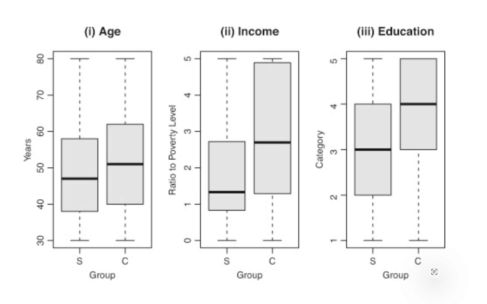
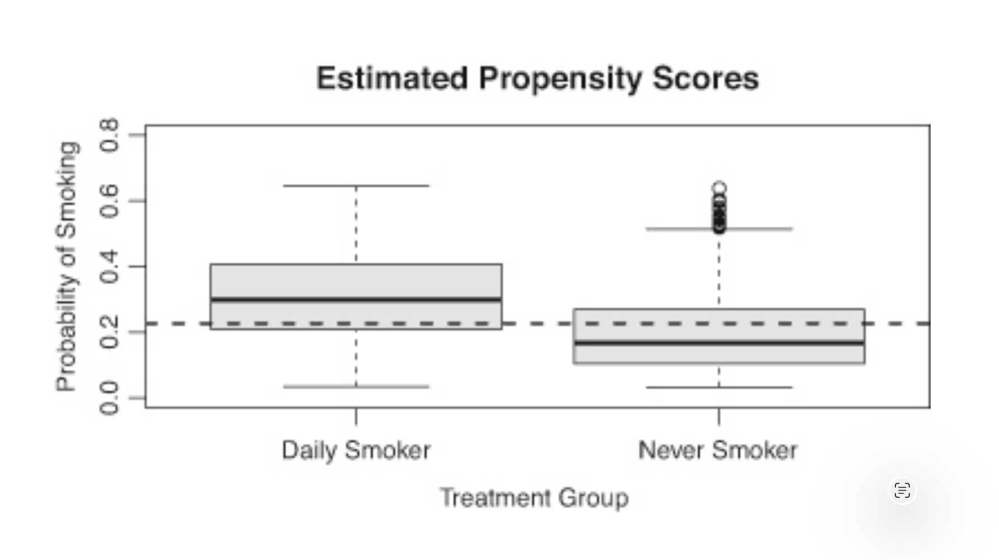
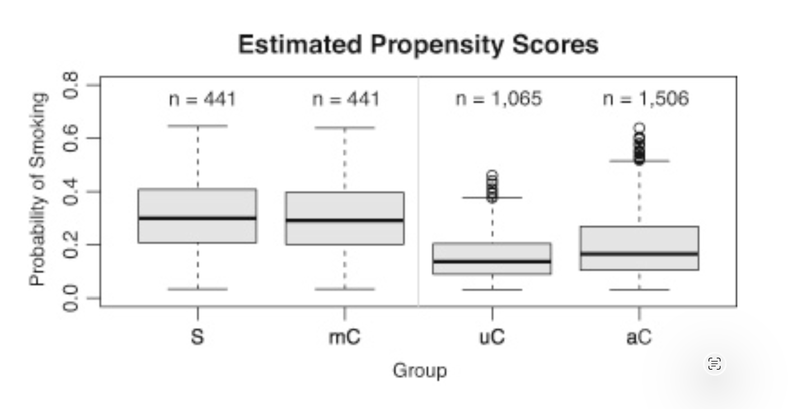
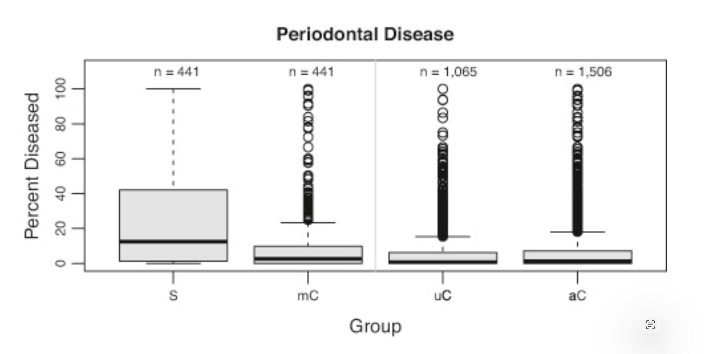

#     Cause  or Coincidence

<!--
⏱️ Slide Timing: 1 min

- Open with the framing question: how do we ever *prove* one thing causes another
- Set expectations — this isn't abstract statistics, it's a life-or-death question
- Preview the arc: a 1799 deathbed, a 2018 Ebola trial, and a smoking study
-->

---
# Watch: Cause or Coincidence?

- Full narrated walkthrough of the ideas covered in this deck
- [Cause or Coincidence?](https://www.youtube.com/watch?v=h6NjNGNDL7g)

<!--
⏱️ Slide Timing: 1 min

- Recommend watching before or after this session — the visuals pair well with narration
- Video covers the same case studies in the same order as this deck
- Useful as a refresher or to share with someone who missed the session
-->

---

# 1. The Core Challenge

> **"To understand cause and effect, you can't just sit back and watch; you have to interfere."** 
- **Historical Case:** In 1799, doctors drained half of **George Washington's** blood to treat a sore throat. He died the next day. 
- **The Question:** Did the treatment kill him, or would he have died anyway? 
- **The Struggle:** For 2,000 years, doctors believed bloodletting worked because they didn't have a way to prove otherwise. 

<!--
⏱️ Slide Timing: 3 min

- George Box quote is the thesis of the whole deck
  - passive observation can never establish causation — only intervention can
- Washington case is deliberately extreme
  - best doctors of the era, most advanced treatment available, and it likely killed him
- 2,000 years of doctors "swearing by" bloodletting is the real lesson
  - without a way to compare against the road not taken, even smart people mistake a coincidence for a cure
❓ Ask: "If Washington's doctors were the best in the world, how did they get it so wrong for two millennia?"
-->

---

# 2. The Fundamental Problem

- **Actual World:** 
  - What we see (e.g., Washington was bled and died). 
- **Alternative World (Counterfactual):** 
  - What would have happened if he wasn't bled. 
- **The Gap:** 
  - We can never "peek" into that alternative world for a single person. 
- **Causal Inference** is the elegant solution to this "insoluble" puzzle

<!--
⏱️ Slide Timing: 2 min

- This is the single hardest idea in the deck — give it room to land
- For any one person, any one moment, only one outcome is ever observed
  - the "what if" world is called the counterfactual, and it's gone the instant the real outcome happens
- Naming the problem is the first step toward solving it
  - everything from here is about approximating the missing counterfactual
-->

---

# 3. The Power of Randomization

- **The PALM Trial (Ebola):** Researchers used a "high-tech coin flip" 
  - to assign treatments
- **Fairness in Uncertainty:** When you don't know which drug is better, 
  - randomization is the fairest path
- **The Statistical Miracle:** 
  - A coin flip balances **seen factors** (age, gender) 
    - AND **unseen factors** (genetics, immune system)

<!--
⏱️ Slide Timing: 3 min

- PALM trial is the modern answer to the Washington problem — a real deathbed decision made scientifically
- Randomization's real power isn't fairness, it's balance
  - it evens out traits researchers can measure *and* ones they can't even name yet
- This is why a coin flip beats a doctor's best guess
  - guesses only account for what's visible; randomness accounts for everything
-->

---

# 4. From Gambler to Casino

- **Single Flip:** 
  - A gamble with no predictable outcome. 
- **Hundreds of Flips:** 
  - You become the **"casino."** 
- **Key Insight:** 
  - Over time, randomness cancels out, and the **true average effect** reveals itself
- **Result:** This probability theory, not a biological discovery, 
  - solved a life-or-death medical problem 

<!--
⏱️ Slide Timing: 2 min

- Casino analogy reframes randomization as inevitability, not luck
  - one flip is uncertain, but hundreds of flips behave predictably in aggregate
- Reinforce the deck's core surprise
  - the Ebola breakthrough came from probability theory, not new biology or a better drug
-->

---

# 5. When Experiments are Impossible

- **The Ethical Barrier:** 
  - We cannot force people to smoke for 40 years to study its effects
- **Observational Data:** 
  - We must study the choices people make for themselves. 
- **The Problem:** 
  - Smokers and non-smokers are different from the start in **age, income, and education.** 
- **The Trap:** 
  - You aren't comparing "apples to apples." 

<!--
⏱️ Slide Timing: 2 min

- Randomization is the gold standard, but it's often unavailable — ethics, cost, or practicality get in the way
- Smoking is the textbook case
  - nobody can be randomly assigned to smoke, so all evidence is observational
- Bridge to the next slides
  - self-selected groups differ before the "treatment" even happens, which is exactly what the chart shows
-->

---
# The Trap: Not comparing "apples to apples"
- Comparison of daily smokers (S) and controls (C)

> credit: "Casual Inference" by Paul Rosenbaum

<!--
⏱️ Slide Timing: 2 min

- Point at the visible spread between the S and C box plots
  - age, income, and education differ before smoking status is even considered
- Any raw comparison of outcomes between these groups is confounded from the start
- This is the visual proof that "just comparing" smokers to non-smokers is not a fair test
-->

---

# 6. The Propensity Score

- **Definition:** 
  - A single number summarizing the **likelihood** a person 
    - would choose a treatment (like smoking) based on their traits 
- **The Gap:** 
  - Plotting these scores shows that treated and control groups are 
    - often not comparable at all 
- **Leveling the Field:** 
  - We need a way to force this "lopsided" data into a fair comparison 

<!--
⏱️ Slide Timing: 3 min

- Propensity score compresses many traits (age, income, education) into one number
  - the probability a given person would have chosen the treatment
- It's a diagnostic, not a fix on its own — it just measures how unbalanced the groups are
- Sets up the next slide's visual proof that smokers and non-smokers occupy very different probability ranges
-->

---
# The Gap: Treated and Control not comparable
- Estimated probabilities of smoking (Propensity Score)

> credit: "Casual Inference" by Paul Rosenbaum

<!--
⏱️ Slide Timing: 2 min

- Smokers cluster at high propensity scores, non-smokers cluster low — almost no overlap
- This is the quantified version of the previous box-plot slide
  - one number now captures the imbalance across all traits at once
- Sets up matching as the natural fix — restrict comparisons to the region where both groups overlap
-->

---

# 7. Statistical Surgery: Matching

- **Statistical Twins:**
  - Matching finds a smoker and a non-smoker 
    - with the **exact same probability** of being a smoker 
- **Trimming the Noise:** 
  - We "toss out" anyone who doesn't have a good match
- **The Outcome:** 
  - After matching, the groups (box plots) for age and education look nearly identical 

<!--
⏱️ Slide Timing: 3 min

- Matching pairs each smoker with a non-smoker who has nearly the same propensity score
  - unmatched people are dropped entirely — the study gets smaller but fairer
- "Statistical surgery" is the right mental image
  - carving two comparable subgroups out of two mismatched populations
- The payoff is visual: matched groups' box plots converge, undoing the imbalance from Slide 5
-->

---
# Matching 
- S: Smokers, mC: matched Controls, 
- uC: unmatched Controls, aC: all Controls

> credit: "Casual Inference" by Paul Rosenbaum

<!--
⏱️ Slide Timing: 2 min

- mC (matched Controls) now overlaps closely with S (Smokers) on propensity score
- uC (unmatched Controls) are the ones discarded — too dissimilar to any smoker to serve as a fair comparison
- This is matching in action: aC (all Controls) narrowed down to only the comparable subset
-->

---

# 8. "Coin People" vs. "Dice People"

- **Coin People:** 
  - Individuals who had a high (50/50) chance of treatment 
- **Dice People:** 
  - Individuals who had a low (1 in 6) chance of treatment 
- **Matching's Logic:** 
  - It ensures we only compare **coin people to other coin people.** 
- **The Result:** 
  - Within these matched groups, it is "pretty much random" who ended up treated 

<!--
⏱️ Slide Timing: 3 min

- "Coin" vs "die" is a memorable shorthand for propensity score buckets
  - high-probability people vs low-probability people
- The unfairness of the original comparison was mixing these two populations together
- Within a matched coin-vs-coin group, treatment starts to resemble a coin flip again
  - this is what recreates the conditions of a randomized trial inside observational data
-->

---
# Outcome after matching
- Extent of Periodontal disease in smokers and match controls

> credit: "Casual Inference" by Paul Rosenbaum

<!--
⏱️ Slide Timing: 2 min

- Same periodontal disease outcome as before matching, but now measured on a fair comparison
- Because age, income, and education are balanced, the remaining gap is harder to explain away
- This is the payoff of every step so far — turning a biased comparison into a credible one
-->

---

# 9. Turning Noise into Signal

- **The Goal:** 
  - Force biased, real-world data to act like a **clean, randomized experiment.** 
- **Certainty:** 
  - When the gap in outcomes (like periodontal disease) remains after matching, 
    - we can be much more certain it is a **real cause** 
- **Summary:** 
  - We now have the tools to separate genuine cause from mere coincidence 

<!--
⏱️ Slide Timing: 2 min

- Closing synthesis — randomization and matching are two routes to the same goal
  - approximating the counterfactual we can never directly observe
- Bring it back to Washington
  - these tools are exactly what his doctors lacked, and why bloodletting persisted for 2,000 years
- End on the open question the video poses
  - now that we have the tools, where should we point them next?
-->

---
# References

| Topic | Source |
|-------|--------|
| **Rosenbaum, P. R. (2023)** | Rosenbaum, P. R. (2023). [*Causal Inference*](https://mitpress.mit.edu/9780262047474/causal-inference/). MIT Press. |
| **Henao-Restrepo et al. (2019)** | Henao-Restrepo, A. M., et al. (2019). [Efficacy and effectiveness of an rVSV-vectored vaccine in preventing Ebola virus disease: final results from the Guinea ring vaccination trial (PALM trial)](https://www.nejm.org/doi/full/10.1056/NEJMoa1910993). *New England Journal of Medicine*. |

<!--
⏱️ Slide Timing: 1 min

- Rosenbaum's book is the primary source for the propensity score and matching visuals in this deck — highest priority to bookmark for anyone going deeper
- PALM trial citation gives the clinical detail behind the Ebola randomization case study
-->
