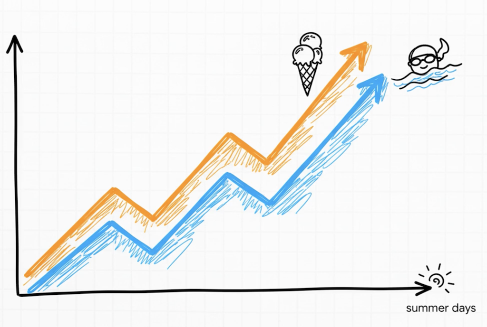
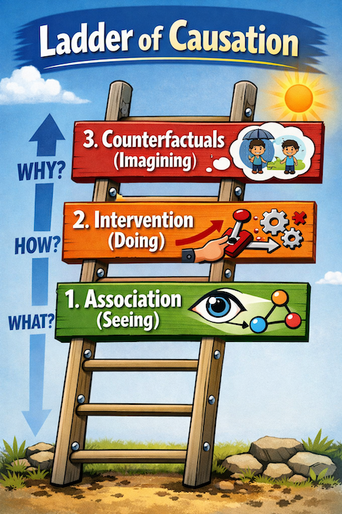

#   Causal Inference
- moving beyond simple connections

<!--
⏱️ Slide Timing: 1 min

- Welcome the group and frame the session: correlation is everywhere, causation is rare
- Preview the ladder of causation as the throughline for the deck
- Set expectation: one classic case study (WWII bombers) anchors the ideas
-->

---
# Watch: Calling Bullshit — Correlation and Causation

- Short primer on why correlation alone never proves causation
- [Correlation and causation](https://www.youtube.com/watch?v=5LGiMpGZ_No)

<!--
⏱️ Slide Timing: 2 min

- Play this before or after the ice cream example — reinforces the same lesson from a different angle
- Encourage the audience to note down their own "spurious correlation" examples while watching
-->

---
# The Correlation Trap

<!--
⏱️ Slide Timing: 2 min

- Let the chart sit for a moment before explaining — ask the audience what they notice first
- The two lines track almost perfectly, which is exactly what makes the trap convincing
❓ Ask: "What do you think is really driving both of these numbers up?"
-->

---

# The Correlation Trap
- **The Observation**: On days when ice cream sales spike, the number of drownings goes up
- **The Logical Error**: Thinking that eating ice cream causes drowning
- **The Fix**: Using causal inference to dig deeper and find hidden forces

<!--
⏱️ Slide Timing: 3 min

- Name the fallacy explicitly: this is a textbook confounding variable problem
- Ice cream and drownings share a common cause rather than causing each other
- Preview that the "hidden force" gets revealed once we start intervening, not just observing
-->

---
# Ladder of Causation
- cause-and-effect thinking 
    - visualized as 
        - three-rung ladder

<!--
⏱️ Slide Timing: 2 min

- Framework from Judea Pearl, one of the founders of modern causal inference
- Each rung requires a different kind of evidence — observation, action, or imagination
- The rest of the deck walks up this ladder one rung at a time
-->

---

# Rung 1: Association
- **Nature**: Pure observation and finding patterns
- **Question**: "How are these things related?"
- **Example**: Noticing ice cream sales and drownings show up together
- **Utility**: Great for prediction, but it doesn't tell you *why*

<!--
⏱️ Slide Timing: 3 min

- Most traditional statistics and ML models live entirely on this rung
- A recommendation engine can predict what you'll click without knowing why you'll click it
- Prediction is useful, but it breaks down the moment you try to change the underlying system
-->

---

# Rung 2: Intervention
- **Nature**: Active participation through experiments
- **Question**: "What happens if we act?"
- **The Ice Cream Test**: If we banned ice cream, would drownings stop?
- **Discovery**: Intervening breaks the correlation and reveals the hidden variable: **hot weather**

<!--
⏱️ Slide Timing: 3 min

- This rung is where A/B tests and randomized controlled trials live
- Banning ice cream is a thought experiment — nothing would happen to drownings, exposing the confounder
- Hot weather drives both ice cream sales and swimming (and therefore drowning risk)
-->

---

# Rung 3: Counterfactuals
- **Nature**: The highest form of causal thinking; imagining things that didn't happen
- **Question**: "What if we had acted differently?"
- **Humanity**: This level allows us to explore alternate versions of the past to understand the present

<!--
⏱️ Slide Timing: 3 min

- Counterfactual reasoning is uniquely human — even advanced AI systems struggle here
- Doctors use this rung constantly: "would the patient have recovered without the treatment?"
- Bridges directly into the bomber case study, which is built entirely on counterfactual thinking
-->

---

# Case Study: WWII Bomber Planes
- **The Problem**: Allied planes were being shot down; armor was needed but could only be placed in specific areas due to weight
- **Rung 1 Analysis**: Engineers mapped bullet holes on returning planes and wanted to armor the wings and tail because that's where the hits were seen

<!--
⏱️ Slide Timing: 3 min

- Setup for one of the most famous applied statistics stories of the 20th century
- Weight limits meant armor was a zero-sum trade-off — every extra pound on the wings came off somewhere else
- The engineers' instinct was reasonable, but purely observational (rung 1) reasoning
-->

---
# Bomber bullet holes map

> credit: By Martin Grandjean (vector), McGeddon (picture), US Air Force (hit plot concept) - Own work, CC BY-SA 4.0, https://commons.wikimedia.org/w/index.php?curid=102017718

<!--
⏱️ Slide Timing: 2 min

- Red dots mark where returning planes were hit — dense on wings and fuselage, sparse on engines and cockpit
- Point out that this dataset only contains survivors, which is the crux of the problem
-->

---

# Abraham Wald's Counterfactual

- **The Rung 3 Question**: Wald asked, "Where are the **missing** bullet holes?"
- **Survivor Bias**: The data only showed planes that made it back
- **The Genius Insight**: Any plane hit in the engines or cockpit never returned to be counted
- **The Solution**: Armor the places where you see *no* damage on survivors

<!--
⏱️ Slide Timing: 4 min

- Wald was a statistician at Columbia's Statistical Research Group during WWII
- The counterfactual question flips the entire analysis: absence of data is itself data
- This insight directly saved lives by redirecting armor to the engines and cockpit
❓ Ask: "Where else might absence of evidence actually be evidence of something?"
-->

---

# Key Takeaways
- **Beyond the Data**: Real wisdom requires looking at information the data *isn't* telling you
- **Discussion Questions**:
  - What are the "missing bullet holes" in your own life or studies?
  - Whose stories are you not hearing at all?

<!--
⏱️ Slide Timing: 6 min

- Tie back to the ladder: association told the engineers where the holes were, counterfactual thinking told Wald where they weren't
- Survivorship bias shows up constantly — in business case studies, hiring, even startup advice
- Open the floor for the discussion questions and let a few people share examples
-->

---
# References

| Topic | Source |
|-------|--------|
| **Molak, A. (2023)** | Molak, A. (2023). [*Causal inference and discovery in Python: Unlock the secrets of modern causal machine learning with DoWhy, EconML, PyTorch and more*](https://www.packtpub.com/product/causal-inference-and-discovery-in-python/9781804612989). Packt Publishing. |
| **Wikipedia contributors (2026)** | Wikipedia contributors. (2026, January 25). [Abraham Wald](https://en.wikipedia.org/wiki/Abraham_Wald). Wikipedia. |
| **Vigen, T. (n.d.)** | Vigen, T. (n.d.). [Spurious correlations](https://www.tylervigen.com/spurious-correlations). |

<!--
⏱️ Slide Timing: 1 min

- Molak's book is the best next step for anyone wanting to apply this hands-on with DoWhy or EconML
- Tyler Vigen's site is a fun way to keep building intuition for spotting spurious correlations
-->
