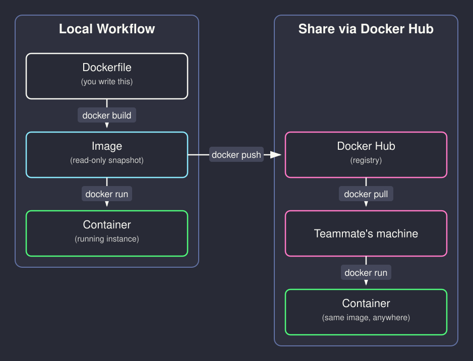
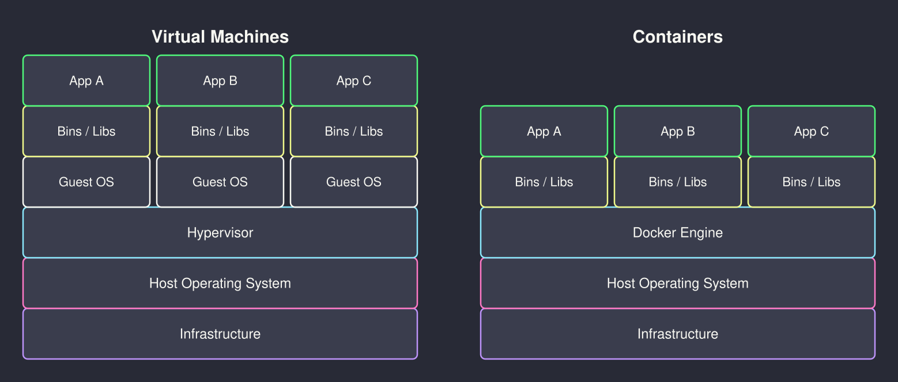

# <br><br><br><br><br>Introduction to Docker


<!--
⏱️ Slide Timing: 1 min

- Welcome to the session — frame Docker as the standard answer to "it works on my machine"
- Promise: by the end, everyone will have built and run their own container
- No prior Docker experience needed — just basic Python familiarity (scripts, pip, running a `.py` file)
- Bridge: start with the pain every developer has hit before showing the fix
-->

---

# The "Works on My Machine" Problem

- You write a script — it runs perfectly on your laptop
- You send it to a classmate — it crashes on theirs
- Different **Python version**, different package versions, missing system libraries
- Deploying to a server? A different OS entirely

> "It works on my machine" is not a deployment strategy

<!--
⏱️ Slide Timing: 3 min

- Most relatable pain point in software — everyone has hit this within their first few group projects
- Analogy: sending a cake recipe without the oven settings, pan size, or ingredient brands
- Root cause: software depends on an invisible stack of system state that never travels with the code
- Docker's fix: package the entire environment, not just the code
❓ Ask: "Has anyone had code that ran on one machine but broke on another?"
-->

---

# What is Docker?

- A tool for packaging software into **containers**
- A container bundles **code + dependencies + runtime** into one portable unit
- Containers run the same way everywhere — laptop, cloud, classmate's machine
- A lightweight, reproducible box for your application

<br>

| Without Docker | With Docker |
|---|---|
| "Install Python 3.11, then pip install..." | `docker run my-app` |
| Breaks across OS / environments | Same behaviour everywhere |
| Manual setup on every machine | One image, runs anywhere |

<!--
⏱️ Slide Timing: 4 min

- Key word: "portable" — like a shipping container in logistics
- Same metal box, same locking mechanism — any ship, truck, or crane can handle it
- Docker doesn't virtualise an entire OS — it shares the host kernel, which is what makes it lightweight
- Became the de facto standard for shipping web apps, APIs, and data pipelines
-->

---

# Key Concepts

- **Dockerfile** — a text recipe describing how to build your environment
- **Image** — the built snapshot created from a Dockerfile (read-only)
- **Container** — a running instance of an image (many containers, one image)
- **Docker Hub** — a public registry of pre-built images (like PyPI for containers)
- **Layer** — each Dockerfile instruction adds a cached layer

<br>

> Image is to Container what a **Class** is to an **Object** in Python

<!--
⏱️ Slide Timing: 4 min

- Class/object analogy lands immediately — students already know this from Python
- Layers matter for speed: change only your code, and Docker reuses the cached dependency layers
- Docker Hub has ready-made images: python:3.11-slim, node:20, postgres — a huge head start
- "slim" variants strip out compilers and docs — smaller image, faster to pull and run
-->

---

# Docker Workflow



<!--
⏱️ Slide Timing: 4 min

- Left path: the local dev loop — build once, run many times
- Right path: `push` to Docker Hub, a teammate `pull`s the exact same image and runs it
- Dockerfile is the only thing you write by hand — Image and Container are generated
- Docker Hub is optional for local experiments, essential once you're sharing with a team or deploying
-->

---

# Docker vs Virtual Machine



> Containers are not VMs — they are isolated **processes**, not emulated machines

<!--
⏱️ Slide Timing: 4 min

- Left: each VM carries a full guest OS and kernel — that's why VMs are measured in GBs and boot in minutes
- Right: all containers share the host kernel — only the app and its libraries are isolated, so images are MBs and start in seconds
- VMs still win when you need a genuinely different OS or kernel-level security isolation
- For everyday app/API development, containers are the lighter, faster default
-->

---

# Installing Docker

1. Download **Docker Desktop** from [`docker.com/get-started`](https://www.docker.com/get-started/)
   - Available for macOS, Windows, Linux
2. Follow the installer — Docker Desktop includes the CLI and GUI
3. Verify the install:

```bash
docker --version
# Docker version 27.x.x

docker run hello-world
# Should print: "Hello from Docker!"
```

> On Linux: install Docker Engine directly — no Desktop needed

<!--
⏱️ Slide Timing: 3 min

- Docker Desktop is the easiest path for students on Mac/Windows
- The hello-world container is a real pull + run — confirms the whole pipeline works end to end
- Common gotcha on macOS/Windows: Docker Desktop must be running (whale icon in the menu bar/tray)
- Have everyone run `docker run hello-world` live before moving on
-->

---

# Essential Docker Commands

<div class="columns">
<div>

```bash
# Build an image
docker build -t my-app .

# List local images
docker images

# Run a container
docker run my-app

# Interactive shell in container
docker run -it my-app bash
```

</div>
<div>

```bash
# List running containers
docker ps

# Show all containers (incl. stopped)
docker ps -a

# Stop / remove a container
docker stop <container_id>
docker rm <container_id>

# Pull image from Docker Hub
docker pull python:3.11-slim
```

</div>
</div>

<!--
⏱️ Slide Timing: 4 min

- `-t` names the image — always give it a meaningful name, not the default hash
- `-it` is the most useful debugging flag: drops you into a shell inside the container
- `docker ps -a` shows stopped containers too — the `-a` is the flag students forget
- Muscle memory to build: build → run → inspect → iterate
-->

---

# Writing a Dockerfile

```dockerfile
# 1. Base image — Python 3.11 without unnecessary extras
FROM python:3.11-slim

# 2. Set working directory inside the container
WORKDIR /app

# 3. Copy and install dependencies FIRST (layer cache trick)
COPY requirements.txt .
RUN pip install -r requirements.txt

# 4. Copy the application code
COPY app.py .

# 5. Default command to run when the container starts
CMD ["python", "app.py"]
```

<!--
⏱️ Slide Timing: 4 min

- Line order matters for caching: dependencies change rarely, code changes often
- Putting `COPY . .` before `RUN pip install` busts the pip cache on every single code change
- `python:3.11-slim` strips compilers and docs, cutting image size roughly 60%
- CMD vs ENTRYPOINT: CMD is the default command (overridable at `docker run`); ENTRYPOINT always runs
-->

---

# Demo: Your First Container

<div class="columns">
<div>

**Project files:**

```
docker_demo/
├── Dockerfile
├── requirements.txt
└── app.py
```

- `Dockerfile` — the build recipe
- `requirements.txt` — one dependency: `pyfiglet`
- `app.py` — prints a banner + the Python version it's running on

</div>
<div>

**`app.py`:**

```python
import platform
import pyfiglet

banner = pyfiglet.figlet_format("Hello Docker")
print(banner)
print(f"Python version : {platform.python_version()}")
print(f"Platform       : {platform.system()}")
print("Running inside a container!")
```

</div>
</div>

<!--
⏱️ Slide Timing: 3 min

- `pyfiglet` is deliberately not installed on the host — it only exists inside the image
- The point: nobody runs `pip install pyfiglet` on their laptop, yet it works identically for everyone
- This exact pattern scales directly to a real app — swap `app.py` for a Flask/FastAPI server and you have a deployable service
- Students follow along on their own laptop for this one
-->

---

# Running the Demo

<div class="columns">
<div>

**Commands:**

```bash
# Navigate to the demo folder
cd docker_demo

# Build the image (~10s first time)
docker build -t docker-demo .

# Run the container
docker run --rm docker-demo
```

</div>
<div>

**Expected output:**

```
 _   _      _ _
| | | | ___| | | ___
| |_| |/ _ \ | |/ _ \
|  _  |  __/ | | (_) |
|_| |_|\___|_|_|\___/

Python version : 3.11.x
Platform       : Linux
Running inside a container!
```

</div>
</div>

<!--
⏱️ Slide Timing: 4 min

- First build takes longer — it downloads the base image and installs pyfiglet
- Second build is fast — Docker reuses the cached dependency layer since requirements.txt hasn't changed
- Note "Platform: Linux" even on macOS/Windows hosts — that's the container's own isolated OS view
- `--rm` auto-deletes the container after it exits — handy for one-off demo runs
- Challenge: edit the message in app.py, rebuild, and notice only the last layer rebuilds
❓ Ask: "What would you need to change to containerise your own script instead?"
-->

---

# Useful Patterns

- **Mount a local folder** to read/write files without rebuilding:
  ```bash
  docker run -v $(pwd)/data:/app/data docker-demo
  ```

- **Set environment variables** (API keys, config):
  ```bash
  docker run -e API_KEY=abc123 my-app
  ```

- **Expose a port** for a web API (e.g., Flask/FastAPI):
  ```bash
  docker run -p 8000:8000 my-api
  ```

<!--
⏱️ Slide Timing: 3 min

- Volume mounts (`-v`) matter whenever data should outlive the container or come from the host
- Environment variables are the clean way to inject secrets — never `COPY .env` into an image
- `-p` maps a host port to a container port — visit `localhost:8000` to reach a containerised API
- These three flags cover the majority of real-world `docker run` usage
-->

---

# Where Docker Fits

| Stage | Docker Use |
|---|---|
| **Development** | Reproducible environment across the whole team |
| **Testing / CI** | Run tests in the same container that ships to prod |
| **Sharing** | `docker push` an image instead of a setup guide |
| **Deployment** | Package app + dependencies as one image |
| **Cloud** | AWS, Azure, GCP all run and scale container images |

> Learn Docker once — the skill transfers to every cloud platform

<!--
⏱️ Slide Timing: 3 min

- Docker is the common currency of the modern software stack, not just an ML or web-dev thing
- CI pipelines run tests inside the exact same container that later ships to production — no more "passed CI, broke in prod"
- Every major cloud platform (AWS ECS/Fargate, Azure Container Apps, Google Cloud Run) runs container images directly
- Tie back to opening problem: pushing an image replaces a page of manual setup instructions
-->

---

# Common Pitfalls

- **Forgetting `-t` on build** — you get an unnamed image, hard to reference later
- **Putting `COPY . .` before `pip install`** — busts the layer cache on every code change
- **Not using `.dockerignore`** — copies `.git/`, `__pycache__/`, `.venv/` into the image, bloating it
- **Hardcoding secrets in the Dockerfile** — use `-e` environment variables instead
- **Forgetting the container is isolated** — files written inside it vanish unless a volume is mounted

<!--
⏱️ Slide Timing: 3 min

- `.dockerignore` works exactly like `.gitignore` — same syntax, same idea, different purpose
- Secrets baked into an image layer are recoverable even after later layers "remove" them — never bake them in
- The "vanishing files" pitfall is the most common first surprise — reinforce that containers are ephemeral by default
-->

---

# References

| Topic | Source |
|---|---|
| **Docker Get Started guide** | Docker Inc. (2026). [Get Started with Docker](https://docs.docker.com/get-started/). Docker Docs. |
| **Dockerfile reference** | Docker Inc. (2026). [Dockerfile reference](https://docs.docker.com/reference/dockerfile/). Docker Docs. |
| **Docker Hub** | Docker Inc. (2026). [Docker Hub](https://hub.docker.com). |
| **Official Python images** | Docker Inc. (2026). [python](https://hub.docker.com/_/python). Docker Hub. |
| **`.dockerignore` reference** | Docker Inc. (2026). [.dockerignore file](https://docs.docker.com/build/building/context/#dockerignore-files). Docker Docs. |

> Start with the official Get Started guide — it covers everything in an interactive, no-install browser tutorial

<!--
⏱️ Slide Timing: 1 min

- Highest priority to bookmark: docs.docker.com/get-started — interactive tutorial, no install needed
- python:3.11-slim is the go-to base image for pure Python projects
- Docker Hub search is the fastest way to find a pre-built image for almost any framework
-->

---

# <br><br>Recap & Practice

- **Docker** packages code + dependencies into portable containers
- **Dockerfile → Image → Container** is the core workflow
- Containers are lighter and faster than VMs — same code, everywhere
- Three commands to remember: `docker build`, `docker run`, `docker ps`
- **Before your next project: containerise it instead of writing a setup README**

<br>

> Ship your environment, not just your code

<!--
⏱️ Slide Timing: 2 min

- Close the loop back to the opening problem: Docker is the fix for "works on my machine"
- The three-command mantra covers most day-to-day usage
- Practice prompt: containerise the `docker_demo` app right now, then try swapping in a script of your own
-->
