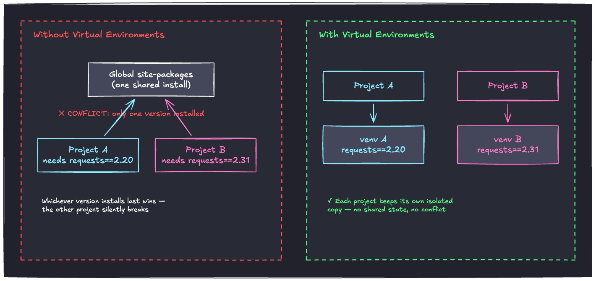
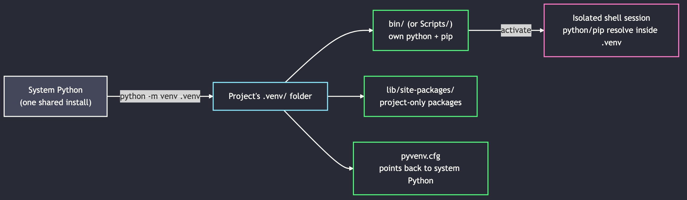

# <br><br><br><br>Python Virtual Environments


<!--
⏱️ Slide Timing: 1 min

- Welcome and frame the session: every Python project needs its own sandbox for packages
- Promise: by the end, everyone will have created, used, and torn down a venv themselves
- Bridge: start with the pain venvs actually solve, before showing the commands
-->

---

# The Problem: One Python, Many Projects
- Your machine has **one** system Python install by default
- Every project you `pip install` into shares that same package library
- Two projects rarely want the *same* version of the *same* package
- Symptom: code that worked last week now throws `ImportError` or version errors

<!--
⏱️ Slide Timing: 3 min

- Ask: has anyone had a project randomly break after installing something for a different project?
  - This is almost always a shared-environment collision
- Frame it as inevitable, not a mistake — the default Python setup has no isolation
- Set up the next slide: show exactly how the collision happens
❓ Ask: "Has your code ever broken after installing something for a totally different project?"
-->

---

# Without vs. With Virtual Environments



<!--
⏱️ Slide Timing: 5 min

- Left panel: Project A and Project B both install into the same global site-packages
  - Whichever `pip install` ran most recently wins — the other project silently starts failing
  - Emphasize "silently" — no error at install time, just broken imports or wrong behavior later
- Right panel: each project gets its own `venv` folder with its own copy of packages
  - No shared state between projects, so conflicting version requirements are a non-issue
- This diagram is the one-slide summary of "why venvs exist" — refer back to it if questions come up later
-->

---

# What a Virtual Environment Actually Is
- A **self-contained folder** holding its own Python interpreter and package library
- Not a separate Python install — it's a lightweight pointer back to your system Python
- Activating it changes *only* what `python` and `pip` resolve to in your current shell
- Deleting the folder removes the environment entirely — nothing else on your machine is affected

<!--
⏱️ Slide Timing: 3 min

- Correct a common misconception: a venv does not copy the entire Python interpreter
  - `pyvenv.cfg` inside it just records the path to the real system Python it was built from
- This is why venvs are cheap to create and safe to throw away
- Bridge: show the folder structure and activation flow visually
-->

---

# Anatomy of a `venv`



<!--
⏱️ Slide Timing: 3 min

- Walk left to right: `python -m venv .venv` creates the folder from the system Python
- `bin/` (or `Scripts/` on Windows) holds venv-local `python` and `pip` executables
- `lib/site-packages/` is where `pip install` actually puts packages — isolated per project
- `activate` just prepends `bin/` to your shell's PATH, so `python`/`pip` resolve inside the venv first
-->

---

# Tooling Landscape
- **`venv`** — built into Python 3.3+, zero extra install, what we'll demo today
- **`uv`** — much faster, manages Python versions too; used across our own course repos
  - Look for `pyproject.toml` + `uv.lock` in a project — that's the `uv` signature
- **`conda`** — popular in data science, manages non-Python dependencies too (e.g. C libraries)
- **`poetry`** — adds dependency resolution and packaging on top of venvs
- Today: stick with `venv` — every tool above builds on the same isolation concept

<!--
⏱️ Slide Timing: 2 min

- Keep this brief — the goal is recognition, not mastery of every tool
- If students see `uv.lock` in a repo later, they should recognize it as "this project uses uv, not raw venv"
- Reassure: the underlying concept (isolated site-packages per project) is identical across all of these
-->

---

# Demo: Create and Activate

```bash
# 1. Create a venv in your project folder
python -m venv .venv

# 2. Activate it
source .venv/bin/activate        # macOS / Linux
.venv\Scripts\activate           # Windows (PowerShell/cmd)

# 3. Confirm it's active — prompt shows (.venv), and:
which python                     # macOS / Linux
where python                     # Windows
```

<!--
⏱️ Slide Timing: 4 min

- Live-type this in the terminal rather than just showing the slide
- Point out the prompt prefix `(.venv)` appearing after activation — that's the visual cue it worked
- `which python` / `where python` should now point *inside* the project folder, not `/usr/bin/python`
- Have students run this on their own machine in parallel, both OSes represented in the room
-->

---

# Demo: Install, Freeze, Deactivate

```bash
# 4. Install a package — lands inside .venv, not globally
pip install requests

# 5. Snapshot exact versions for reproducibility
pip freeze > requirements.txt

# 6. Leave the venv
deactivate
```

<!--
⏱️ Slide Timing: 4 min

- Show `pip freeze` output — this file is what makes the environment reproducible for teammates/graders
- After `deactivate`, re-run `which python` to show it now points back to system Python
- Good moment to try `import requests` in a fresh, non-activated shell — it fails, proving isolation
-->

---

# Demo: Reproduce an Environment

```bash
# On a new machine, or a fresh clone of the project:
python -m venv .venv
source .venv/bin/activate
pip install -r requirements.txt
```

- Anyone can recreate the *exact* same environment from `requirements.txt`
- This is what makes a project's setup reproducible for grading, collaboration, or deployment

<!--
⏱️ Slide Timing: 3 min

- Tie back to the opening problem slide: this is the fix — a portable, exact recipe instead of "it works on my machine"
- Mention this is also exactly what CI systems and graders do when they run student submissions
-->

---

# Common Pitfalls
- **Forgetting to activate** before `pip install` — package lands in the global environment instead
- **Committing `.venv/` to git** — add it to `.gitignore`; commit `requirements.txt` instead
- **One venv per project** — don't reuse a single venv across unrelated projects
- **A broken venv is disposable** — just `deactivate`, delete the folder, and recreate it

<!--
⏱️ Slide Timing: 3 min

- The activation pitfall is the single most common mistake in this room — worth emphasizing twice
- `.venv/` can be hundreds of MB; committing it bloats the repo for no benefit since it's fully reproducible from `requirements.txt`
- Reinforce: nothing irreplaceable ever lives inside a venv folder — deleting it is always safe
-->

---

# Cheat Sheet

| Action | Command |
|---|---|
| Create | `python -m venv .venv` |
| Activate (macOS/Linux) | `source .venv/bin/activate` |
| Activate (Windows) | `.venv\Scripts\activate` |
| Install a package | `pip install <package>` |
| Save exact versions | `pip freeze > requirements.txt` |
| Reinstall from file | `pip install -r requirements.txt` |
| Deactivate | `deactivate` |
| Delete | remove the `.venv/` folder |

<!--
⏱️ Slide Timing: 2 min

- Suggest students screenshot this slide — it's the reference they'll reach for in every future project
-->

---

# References

| Topic | Source |
|-------|--------|
| **`venv`docs** | Python Software Foundation. (2026). [`venv` — Creation of virtual environments](https://docs.python.org/3/library/venv.html). Python 3 Documentation. |
| **PEP 405** | Eby, C. (2012). [PEP 405 – Python Virtual Environments](https://peps.python.org/pep-0405/). Python Enhancement Proposals. |
| **`pip`guide** | Python Packaging Authority. (2026). [Installing packages using pip and virtual environments](https://packaging.python.org/en/latest/guides/installing-using-pip-and-virtual-environments/). Python Packaging User Guide. |
| **`uv` docs** | Astral. (2026). [uv — An extremely fast Python package manager](https://docs.astral.sh/uv/). Astral Docs. |

<!--
⏱️ Slide Timing: 1 min

- Highest priority to bookmark: the official `venv` docs — it's the canonical reference for every flag and edge case
-->

---

# <br><br>Recap & Practice

- A venv is a disposable, isolated copy of your project's packages
- Create → activate → install → freeze → deactivate
- **Before you write a single line of code on your next assignment: create a venv first**

<!--
⏱️ Slide Timing: 2 min

- Close the loop back to the opening problem: isolation is what prevents the "works on my machine" failure mode
- Practice prompt: have students create a venv for their next assignment right now, before leaving class
-->
