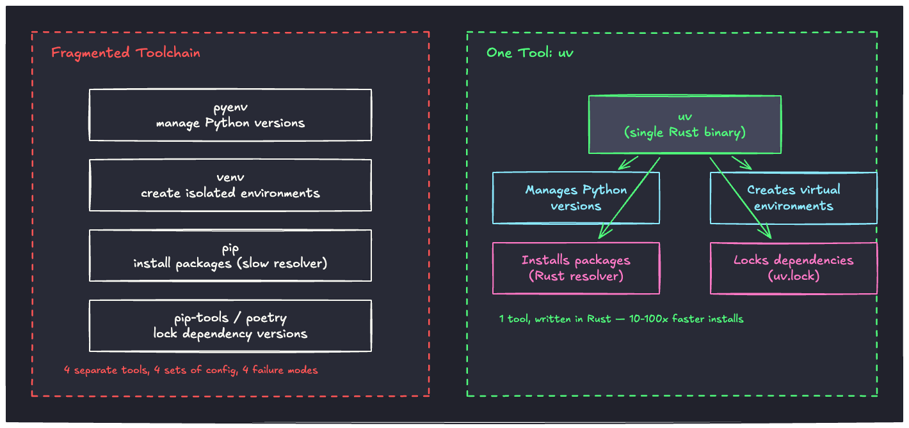
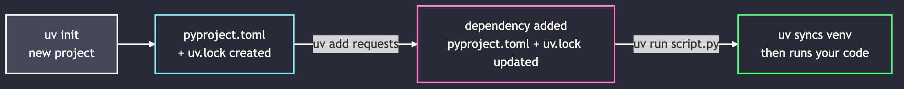

# <br><br><br><br>uv


<!--
⏱️ Slide Timing: 1 min

- Welcome and frame the session: one tool to replace the whole Python packaging toolchain we've been using
- Promise: by the end, everyone will have created a project, added a dependency, and run code with uv
- Bridge: start with the pain of juggling separate tools, since that's exactly what uv removes
-->

---

# The Problem: Too Many Tools
- **pyenv** to manage Python versions
- **venv** to create isolated environments
- **pip** to install packages — with a notoriously slow dependency resolver
- **pip-tools** or **poetry** on top, just to get reliable version locking
- Four tools, four config formats, four things that can go out of sync

<!--
⏱️ Slide Timing: 3 min

- Ask: how many separate commands did the venv session need just to get a project running?
  - `python -m venv`, `activate`, `pip install`, `pip freeze` — and that's before even touching Python versions
- Frame it as accumulated tooling debt — each tool solves one problem but they don't talk to each other well
- Bridge: show what replacing all of it with one tool looks like
❓ Ask: "How many different commands did we need last time just to set up one project?"
-->

---

# Fragmented Toolchain vs. `uv`



<!--
⏱️ Slide Timing: 5 min

- Left panel: four separate tools, each with its own install method, config file, and quirks
  - A version mismatch between any two of them is a common source of "works on my machine"
- Right panel: `uv` is a single Rust binary that does all four jobs
  - Same author (Astral) also makes `ruff`, the fast linter — same design philosophy: replace slow Python tooling with Rust
- The 10-100x speed claim is real and reproducible — worth demonstrating live if time allows
-->

---

# What `uv` Actually Is
- A single, fast, all-in-one Python package and project manager, written in Rust
- Built by **Astral** — same team behind the `ruff` linter/formatter
- Drop-in replacement for `pip`, `venv`, `pip-tools`, `virtualenv`, and (largely) `pyenv`
- Manages `pyproject.toml` and `uv.lock` automatically — no manual `requirements.txt` bookkeeping

<!--
⏱️ Slide Timing: 3 min

- Key framing: uv isn't a new concept, it's a faster, unified implementation of tools students already know
- `uv.lock` replaces `pip freeze > requirements.txt` — but it's generated and updated automatically, not by hand
- Bridge: show the day-to-day command flow before the demo
-->

---

# How the Workflow Flows



<!--
⏱️ Slide Timing: 3 min

- Walk left to right: `uv init` scaffolds a new project with `pyproject.toml` and `uv.lock` already in place
- `uv add <package>` updates both files in one step — no separate `pip install` + manual `requirements.txt` edit
- `uv run` is the key habit change: it syncs the environment to match the lock file, then runs your code — no manual activate step
-->

---

# Installation

```bash
# macOS / Linux
curl -LsSf https://astral.sh/uv/install.sh | sh

# Windows (PowerShell)
powershell -c "irm https://astral.sh/uv/install.ps1 | iex"

# Or via pip, if you already have Python installed
pip install uv
```

- Installs a single self-contained binary — no Python required to bootstrap it
- Verify with `uv --version`

<!--
⏱️ Slide Timing: 2 min

- Have students run the install command for their OS now, then confirm with `uv --version`
- Mention `uv` can also install and manage Python itself — `uv python install 3.12` — no separate pyenv needed
-->

---

# Demo: Start a New Project

```bash
# 1. Scaffold a new project
uv init my-project
cd my-project

# 2. Add a dependency — creates the venv automatically if needed
uv add requests

# 3. Run code inside the managed environment — no activate step
uv run python -c "import requests; print(requests.__version__)"
```

<!--
⏱️ Slide Timing: 4 min

- Live-type this in the terminal rather than just showing the slide
- Point out: no `python -m venv`, no `source .venv/bin/activate` — `uv run` handles environment sync automatically
- Open `pyproject.toml` and `uv.lock` after step 2 to show what changed
-->

---

# Demo: Everyday Commands

```bash
# Add a dev-only dependency (e.g. a test runner)
uv add --dev pytest

# Remove a dependency
uv remove requests

# Recreate the exact environment from uv.lock (e.g. on a teammate's machine)
uv sync

# Run a script or command inside the project's environment
uv run pytest
```

<!--
⏱️ Slide Timing: 4 min

- `uv sync` is the equivalent of `pip install -r requirements.txt`, but reads the exact locked versions from `uv.lock`
- Emphasize `uv run` as the default way to execute anything in the project — replaces manual activation entirely
- `--dev` dependencies (like test tools) are excluded from a production install by default
-->

---

# uv vs. Traditional Commands

| Traditional | uv equivalent |
|---|---|
| `python -m venv .venv` | *(automatic — created on first `uv add`/`uv run`)* |
| `source .venv/bin/activate` | *(not needed — use `uv run ...`)* |
| `pip install requests` | `uv add requests` |
| `pip freeze > requirements.txt` | *(automatic — `uv.lock` stays in sync)* |
| `pip install -r requirements.txt` | `uv sync` |
| `pyenv install 3.12` | `uv python install 3.12` |

<!--
⏱️ Slide Timing: 3 min

- This is the slide students will screenshot — it maps every old habit onto its uv equivalent directly
- Emphasize the two "not needed" rows — those are entire steps that simply disappear from the workflow
-->

---

# Common Pitfalls
- **Editing `pyproject.toml` by hand for dependencies** — use `uv add`/`uv remove` so `uv.lock` stays in sync
- **Forgetting `uv run`** — running `python script.py` directly uses whatever Python is on your PATH, not the project's venv
- **Committing `.venv/` but not `uv.lock`** — it's the reverse of what should be committed; `.venv/` is disposable, `uv.lock` is the source of truth
- **Mixing `pip install` into a uv-managed project** — installs outside `uv.lock` tracking and can drift from what teammates have

<!--
⏱️ Slide Timing: 3 min

- The "forgetting uv run" pitfall is the most common one in practice — reinforce it as the new default reflex
- Tie back to the venv session: `.gitignore` should exclude `.venv/`, same as before — `uv.lock` is what gets committed instead of `requirements.txt`
-->

---

# Cheat Sheet

| Action | Command |
|---|---|
| Install uv | `curl -LsSf https://astral.sh/uv/install.sh \| sh` |
| New project | `uv init <name>` |
| Add a dependency | `uv add <package>` |
| Add a dev dependency | `uv add --dev <package>` |
| Remove a dependency | `uv remove <package>` |
| Sync environment to lock file | `uv sync` |
| Run code in the project env | `uv run <command>` |
| Install a Python version | `uv python install <version>` |

<!--
⏱️ Slide Timing: 2 min

- Suggest students screenshot this slide — it's the reference they'll reach for in every future project
-->

---

# References

| Topic | Source |
|-------|--------|
| **Official `uv` documentation** | Astral. (2026). [uv — An extremely fast Python package manager](https://docs.astral.sh/uv/). Astral Docs. |
| **`uv` GitHub repository** | Astral. (2026). [astral-sh/uv](https://github.com/astral-sh/uv). GitHub. |
| **`uv` benchmark results** | Astral. (2026). [uv: Benchmarks](https://github.com/astral-sh/uv?tab=readme-ov-file#benchmarks). GitHub. |

<!--
⏱️ Slide Timing: 1 min

- Highest priority to bookmark: the official docs — command reference and migration guides live there
-->

---

# <br><br>Recap & Practice

- `uv` replaces pyenv + venv + pip + pip-tools/poetry with one fast, unified tool
- `uv add`, `uv run`, and `uv sync` cover nearly everything you'll need day to day
- **Before your next assignment: `uv init` the project instead of `python -m venv`**

<!--
⏱️ Slide Timing: 2 min

- Close the loop back to the opening problem: one tool instead of four, with automatic lock-file management
- Practice prompt: have students convert their current venv-based project to uv right now, before leaving class
-->
