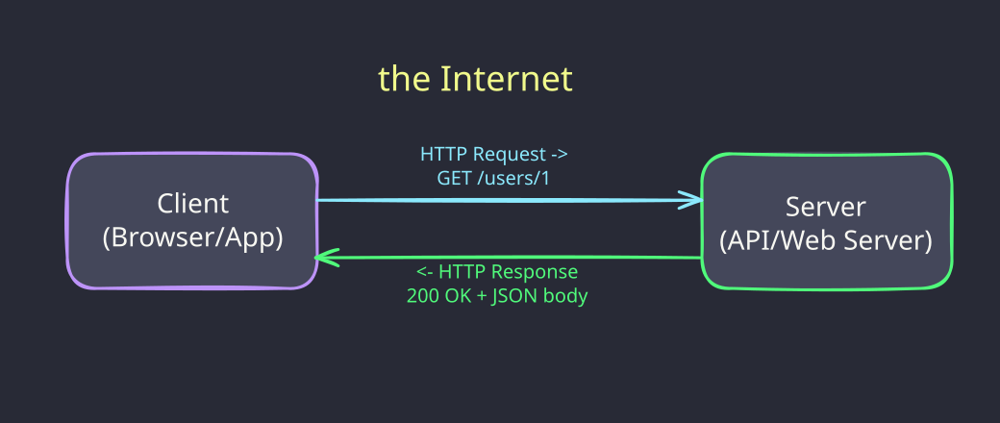
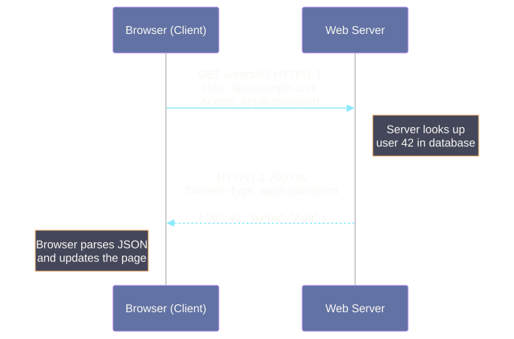
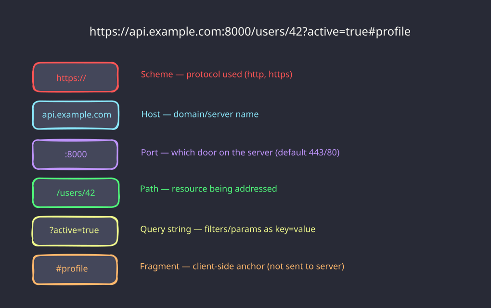
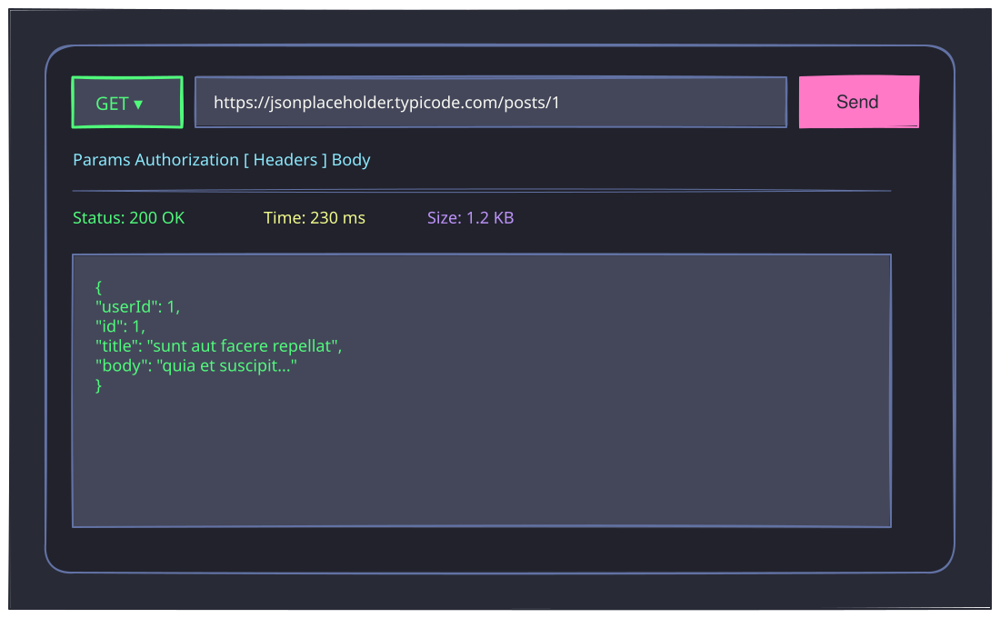

# <br><br><br>HTTP and REST APIs


<!--
⏱️ Slide Timing: 1 min

- Welcome and frame the session: every website and every Python `requests.get()` call rides on the same protocol — HTTP
- Promise: by the end, everyone can read a raw HTTP request/response, explain what REST means, and call a real API from Python
- Bridge: start from the most basic question — what actually happens when you type a URL into a browser
-->

---

# What is HTTP?

- **HyperText Transfer Protocol** — the language browsers and servers speak
- A **client-server** protocol for exchanging resources
  - web pages, images, JSON data, files
- **Stateless**: each request is independent
    - the server remembers nothing between them
- Sits at the **application layer**, carried over **TCP** (transport layer)
  - HTTP defines the message format, TCP guarantees the bytes arrive intact and in order

<!--
⏱️ Slide Timing: 3 min

- Analogy: HTTP is like a standardized order form at a restaurant — client fills it out, server fills the order, no memory of your last visit
- Stateless is the counterintuitive part — ask students how logins "remember" you if the protocol has no memory
- Bridge: apps use cookies/tokens on top of HTTP to fake statefulness — we'll touch this in the auth slide
❓ Ask: "If HTTP forgets everything between requests, how does a website keep you logged in?"
-->

---

# Client-Server Architecture



<!--
⏱️ Slide Timing: 3 min

- Client initiates — server never contacts you first in plain HTTP
- Every Python `requests.get(url)` call is playing the "client" role in this exact picture
- The arrows are the whole mental model for this entire deck — everything else is detail on top of "request out, response back"
-->

---

# The Request-Response Cycle



<!--
⏱️ Slide Timing: 4 min

- Walk through top to bottom: client sends a request line + headers, server processes, server replies with a status + headers + body
- The "Note" boxes are where your backend code (or the API you're calling) actually does work — everything else is just envelope
- Bridge: let's see what these messages actually look like as raw text
-->

---

# Anatomy of a URL



<!--
⏱️ Slide Timing: 3 min

- Scheme + host + port get you to the right server; path + query + fragment tell that server what you want
- Fragment is the one piece that never leaves the browser — good trivia: `#profile` never appears in server logs
- Students will build query strings constantly with the `requests` library — worth lingering on that box
-->

---

# A Raw HTTP Request

```http
GET /posts/1 HTTP/1.1
Host: jsonplaceholder.typicode.com
Accept: application/json
```

- Line 1: **method** + **path** + **protocol version**
- `Host`: which server to talk to (one IP can serve many domains)
- `Accept`: what response format the client wants back

<!--
⏱️ Slide Timing: 3 min

- This is literally what your browser or `requests` library sends over the wire — nothing hidden
- Point out there's no body on a GET — data goes in the URL/query string, not the payload
-->

---

# A Raw HTTP Response

```http
HTTP/1.1 200 OK
Content-Type: application/json; charset=utf-8

{
  "userId": 1,
  "id": 1,
  "title": "sunt aut facere repellat",
  "body": "quia et suscipit..."
}
```

- Status line: protocol version + **status code** + reason phrase
- Headers describe the body; blank line separates headers from **body**

<!--
⏱️ Slide Timing: 3 min

- Same shape every time: status line, headers, blank line, body — that pattern never changes
- This blank line trips people up when they try to hand-write raw HTTP — it's the hard boundary between metadata and payload
-->

---

# Common HTTP Methods

| Method | Purpose | Has a body? |
|---|---|---|
| **GET** | Retrieve a resource | No |
| **POST** | Create a new resource | Yes |
| **PUT** | Replace a resource entirely | Yes |
| **PATCH** | Partially update a resource | Yes |
| **DELETE** | Remove a resource | Usually no |

<!--
⏱️ Slide Timing: 4 min

- PUT vs PATCH is the classic mix-up: PUT replaces the whole object, PATCH edits just the fields you send
- These five methods cover roughly 95% of everything students will do calling APIs
- Bridge: map these methods onto REST resource design next
-->

---

# Method Examples — Raw HTTP

```http
POST /posts HTTP/1.1
Host: jsonplaceholder.typicode.com
Content-Type: application/json

{ "title": "Hello", "body": "World", "userId": 1 }
```

```http
DELETE /posts/1 HTTP/1.1
Host: jsonplaceholder.typicode.com
```

<!--
⏱️ Slide Timing: 3 min

- POST carries a body describing the new resource; note the required `Content-Type` header
- DELETE typically has no body — the URL alone identifies what to remove
-->

---

# HTTP Status Codes

- **1xx** — Informational (rarely seen directly)
- **2xx** — Success (`200 OK`, `201 Created`, `204 No Content`)
- **3xx** — Redirection (`301 Moved Permanently`)
- **4xx** — Client error (`400 Bad Request`, `401 Unauthorized`, `404 Not Found`)
- **5xx** — Server error (`500 Internal Server Error`)

> Rule of thumb: **4xx = you made a mistake, 5xx = the server did**

<!--
⏱️ Slide Timing: 3 min

- 404 is the one everyone already knows — anchor the rest of the ranges to that familiar one
- 401 vs 403 is a common interview question: 401 means "who are you," 403 means "I know who you are, still no"
-->

---

# Status Code Examples

```http
HTTP/1.1 201 Created
Content-Type: application/json

{ "id": 101, "title": "Hello", "body": "World", "userId": 1 }
```

```http
HTTP/1.1 404 Not Found
Content-Type: application/json

{ "error": "Resource not found." }
```

<!--
⏱️ Slide Timing: 2 min

- 201 Created is the expected response to a successful POST — note the new `id` in the body
- Well-designed APIs put a human-readable `error` message in the body even on failure — always print `response.text` when debugging
-->

---

# JSON — the Language of APIs

- **JavaScript Object Notation** — lightweight, human-readable data format
- Key-value pairs, nested objects and arrays, no code execution
- Almost every modern web API sends and receives JSON

```json
{
  "id": 42,
  "name": "Ada Lovelace",
  "skills": ["python", "math"],
  "active": true
}
```

<!--
⏱️ Slide Timing: 3 min

- JSON maps almost 1:1 onto Python dicts and lists — that's why `response.json()` is so convenient
- Point out the types available: string, number, boolean, null, array, object — no dates, no sets, no tuples
-->

---

# HTTP Headers

- Metadata sent with every request and response
- Tell the server (and client) **how to interpret the data**

| Header | Example Value | Purpose |
|---|---|---|
| `Content-Type` | `application/json` | Format of the body being sent |
| `Accept` | `application/json` | Format you want back |
| `Authorization` | `Bearer sk-abc123` | Identity / API key |
| `User-Agent` | `python-requests/2.31` | What client is making the call |

<!--
⏱️ Slide Timing: 3 min

- `Content-Type` describes what you're sending; `Accept` describes what you want back — students often confuse the two
- Missing `Content-Type: application/json` on a POST is one of the most common bugs in early API code
-->

---

# What is an API?

- **Application Programming Interface** — a contract for how software talks to software
- A **Web API** exposes that contract over HTTP
- Client sends a request to an **endpoint** (a URL), server returns structured data
- You don't need to know how the server works inside — only its **interface**

<!--
⏱️ Slide Timing: 2 min

- Analogy: a restaurant menu is an API — you don't need to know the kitchen, just what you can order and what comes back
- Bridge: REST is simply the most common *style* of designing these web APIs
-->

---

# What Makes an API "RESTful"?

- **REST** = **RE**presentational **S**tate **T**ransfer, a design style (not a protocol)
- **Resources** are nouns, identified by URLs — `/users`, `/users/42`, `/users/42/orders`
- **Methods are verbs** — GET/POST/PUT/PATCH/DELETE act on those nouns
- **Stateless** — every request carries everything the server needs (matches HTTP itself)
- Responses typically use **JSON** as the data format

<!--
⏱️ Slide Timing: 4 min

- Key mental shift: URLs name *things*, HTTP methods say what to *do* to them — `/deleteUser?id=42` is not RESTful, `DELETE /users/42` is
- Nesting resources (`/users/42/orders`) reads almost like a sentence — "orders belonging to user 42"
- This is a convention, not an enforced standard — different teams bend the rules; the goal is predictability for the client
-->

---

# REST Resource, Mapped to HTTP Methods



<!--
⏱️ Slide Timing: 3 min

- Same URL, `/users/42`, different verb, completely different action — that's the whole idea of REST in one picture
- This GET/POST/PUT-PATCH/DELETE mapping is often called "CRUD" — Create, Read, Update, Delete
❓ Ask: "If /users/42 is the resource, what URL would list *all* users?"
-->

---

# Testing APIs Without Code — Postman

- **Postman**: a GUI app for building, sending, and inspecting HTTP requests
  - [www.postman.com](https://www.postman.com) — free desktop app or web version
- No code needed — pick a method, type a URL, hit **Send**
- Great for **exploring** an API before writing a single line of Python
- Also useful for: saving requests in **collections**, sharing with teammates, generating docs

<!--
⏱️ Slide Timing: 2 min

- Frame Postman as the "training wheels" step — see the request/response shape visually before writing `requests` code
- Every concept covered so far (method, URL, headers, status, body) maps directly onto a labeled field in the Postman UI
-->

---

# Anatomy of a Postman Request



<!--
⏱️ Slide Timing: 4 min

- Top bar: method dropdown + URL bar + Send button — literally `requests.get(url)` as a UI
- Tabs (Params / Authorization / Headers / Body) are exactly the pieces from earlier slides, just in dedicated boxes instead of a raw HTTP request
- Bottom panel: status, time, size, then the parsed JSON body — the same information as `response.status_code`, `response.elapsed`, `response.json()`
❓ Ask: "Which tab would you click to add an Authorization header for an API key?"
-->

---

# Sending Requests in Postman

**A GET request**
1. Click `New` → `HTTP`, select **GET**
2. Enter URL: `https://jsonplaceholder.typicode.com/posts/1`
3. Click **Send** → inspect the response panel

**A POST request**
1. Change method to **POST**, same base URL without `/1`
2. `Body` tab → `raw` → `JSON`, enter `{ "title": "Hello", "userId": 1 }`
3. Click **Send** → expect `201 Created`

<!--
⏱️ Slide Timing: 4 min

- Live-demo both if time allows — GET first to build confidence, then POST to show the Body tab
- Point out the method-color convention: GET is green, POST is orange/yellow in Postman — same visual language across the tool
-->

---

# Postman Environment Variables

- Store secrets (API keys, base URLs) as **variables** instead of hardcoding them in requests
- Click **Environments** (top-right) → `+` → add a variable, e.g. `HF_TOKEN` (type: `secret`)
- Reference it anywhere with double curly braces:

```
Authorization: Bearer {{HF_TOKEN}}
```

> Same idea as `os.environ["API_TOKEN"]` in Python — never paste a real key directly into a request

<!--
⏱️ Slide Timing: 3 min

- Directly mirrors the "never hardcode keys" pitfall from the Python auth slide — same discipline, different tool
- Switching environments (e.g. dev vs. prod) is just a dropdown — one more reason teams standardize on this instead of hardcoded values
-->

---

# Calling an API from Python

```python
import requests

response = requests.get("https://jsonplaceholder.typicode.com/posts/1")

print(response.status_code)   # 200
print(response.headers["Content-Type"])
print(response.json())        # parsed dict, ready to use
```

- `requests` is the standard library for HTTP in Python (`uv add requests`)
- `.json()` parses the body straight into a Python dict/list

<!--
⏱️ Slide Timing: 4 min

- Live-run this if possible — jsonplaceholder.typicode.com needs no API key, perfect for a first demo
- `response.status_code` and `response.json()` are the two attributes students will use in nearly every script they write
-->

---

# Sending Data — POST with a JSON Body

```python
import requests

payload = {"title": "Hello", "body": "World", "userId": 1}
response = requests.post(
    "https://jsonplaceholder.typicode.com/posts",
    json=payload,
)

print(response.status_code)   # 201
print(response.json()["id"])  # new resource id
```

- `json=payload` auto-encodes the dict **and** sets `Content-Type: application/json`
- Compare to `data=payload`, which sends form-encoded data instead — a common source of 400 errors

<!--
⏱️ Slide Timing: 4 min

- The `json=` vs `data=` distinction is the #1 gotcha students hit — emphasize it explicitly
- Point out how little code this is compared to the raw HTTP text two demo cycles ago — `requests` builds the message for you
-->

---

# Query Parameters and Headers in Python

```python
import requests

response = requests.get(
    "https://jsonplaceholder.typicode.com/posts",
    params={"userId": 1},                       # -> ?userId=1
    headers={"Authorization": "Bearer YOUR_TOKEN"},
)

for post in response.json():
    print(post["title"])
```

- `params=` builds and URL-encodes the query string for you
- `headers=` sends any custom headers — most often used for authentication

<!--
⏱️ Slide Timing: 3 min

- Tie straight back to the URL anatomy slide — `params` is just a Python-friendly way to build that `?key=value` section
- Never hand-build query strings with string concatenation — `params=` handles escaping special characters safely
-->

---

# API Authentication Basics

- Most real-world APIs require proof of identity — an **API key** or **token**
- Most common pattern: `Authorization` header with a **Bearer token**

```
Authorization: Bearer YOUR_API_KEY
```

- Common services using this pattern: GitHub, Stripe, OpenAI, HuggingFace
- **Never hardcode keys in source code** — load from environment variables instead

```python
import os, requests
headers = {"Authorization": f"Bearer {os.environ['API_TOKEN']}"}
```

<!--
⏱️ Slide Timing: 4 min

- 401 Unauthorized almost always means a missing or malformed Authorization header — students will see this often
- Tie back to the `.env` / `python-dotenv` habits from earlier sessions — same discipline applies to API keys
-->

---

# Error Handling in Python

```python
response = requests.get("https://jsonplaceholder.typicode.com/posts/9999")

if response.status_code == 200:
    data = response.json()
else:
    print(f"Request failed: {response.status_code} - {response.text}")

# or, raise an exception on any 4xx/5xx:
response.raise_for_status()
```

- Always check `status_code` (or use `raise_for_status()`) before trusting `.json()`
- `.text` shows the raw response body — invaluable for debugging error messages

<!--
⏱️ Slide Timing: 3 min

- `raise_for_status()` is the idiomatic shortcut — it raises `HTTPError` automatically on any 4xx/5xx response
- Common bug: calling `.json()` on an error response that isn't actually JSON — check status first
-->

---

# HTTP + REST in Practice

<div class="columns">
<div>

**You will use this to:**
- Fetch data from public APIs
- Submit forms and data to a backend
- Call ML/LLM inference endpoints
- Build your own backend routes later

</div>
<div>

**Typical flow, every time:**
1. Pick the right method + URL
2. Add headers (auth, content-type)
3. Send params or a JSON body
4. Check `status_code`
5. Parse `.json()` and use the data

</div>
</div>

<!--
⏱️ Slide Timing: 3 min

- This five-step flow is the same whether you're calling a weather API or a production ML endpoint — reinforce it as the reusable pattern
- Good moment to preview: later sessions on building your own API will flip this diagram around, server side instead of client side
-->

---

# Common Pitfalls

- **Forgetting `Content-Type`** when sending a JSON body — server can't parse it correctly
- **Using `data=` instead of `json=`** in `requests` — sends the wrong encoding
- **Not checking `status_code`** before calling `.json()` — crashes on error responses
- **Hardcoding API keys** in scripts — security risk, breaks if committed to git
- **Confusing PUT and PATCH** — PUT replaces the whole resource, PATCH updates part of it

<!--
⏱️ Slide Timing: 3 min

- These five cover the overwhelming majority of "my API call isn't working" questions in office hours
- Suggest students bookmark this slide specifically — the fastest debugging checklist for API issues
-->

---

# Cheat Sheet

| Action | Python (`requests`) |
|---|---|
| GET request | `requests.get(url)` |
| GET with query params | `requests.get(url, params={...})` |
| POST with JSON body | `requests.post(url, json={...})` |
| Add headers / auth | `requests.get(url, headers={...})` |
| Check success | `response.status_code`, `response.raise_for_status()` |
| Parse JSON response | `response.json()` |
| Raw response text | `response.text` |

<!--
⏱️ Slide Timing: 2 min

- Suggest students screenshot this slide — it's the reference they'll reach for on every future assignment involving an API
-->

---

# References

| Topic | Source |
|-------|--------|
| **HTTP/1.1 specification** | Fielding, R., & Reschke, J. (2014). [*Hypertext Transfer Protocol (HTTP/1.1): Semantics and Content*](https://www.rfc-editor.org/rfc/rfc7231). RFC 7231, IETF. |
| **REST architectural style** | Fielding, R. (2000). [*Architectural Styles and the Design of Network-based Software Architectures*](https://www.ics.uci.edu/~fielding/pubs/dissertation/top.htm) (Doctoral dissertation, Chapter 5). University of California, Irvine. |
| **MDN HTTP documentation** | Mozilla. (2026). [HTTP — MDN Web Docs](https://developer.mozilla.org/en-US/docs/Web/HTTP). |
| **`requests` library docs** | Reitz, K. (2026). [Requests: HTTP for Humans](https://requests.readthedocs.io/). |
| **HTTP status codes reference** | Mozilla. (2026). [HTTP response status codes — MDN Web Docs](https://developer.mozilla.org/en-US/docs/Web/HTTP/Status). |
| **Test API for practice** | typicode. (2026). [JSONPlaceholder — Free fake API for testing](https://jsonplaceholder.typicode.com/). |
| **Postman documentation** | Postman, Inc. (2026). [Postman Learning Center](https://learning.postman.com/). |

<!--
⏱️ Slide Timing: 1 min

- Highest priority to bookmark: MDN HTTP docs for day-to-day lookups, JSONPlaceholder for risk-free practice calls
-->

---

# <br><br>Recap & Practice

- HTTP is a stateless client-server protocol: request out, response back, every time
- REST names resources as URLs 
    - uses HTTP methods as the verbs that act on them
- `requests.get/post(url, params=, json=, headers=)` 
    - covers nearly every API call you'll write


<!--
⏱️ Slide Timing: 2 min

- Close the loop back to the opening promise: raw HTTP, REST concepts, and a working Python call, all covered
- Practice prompt: JSONPlaceholder or any open public API works — the goal is muscle memory on status codes and `.json()`
-->
