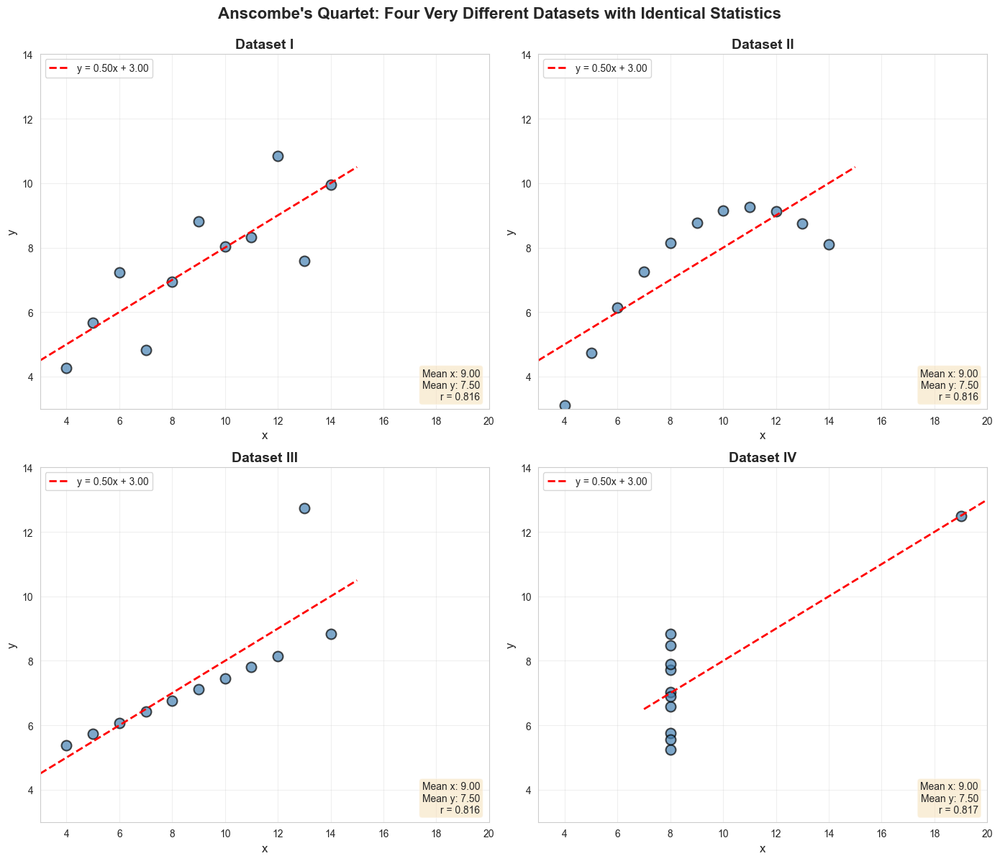
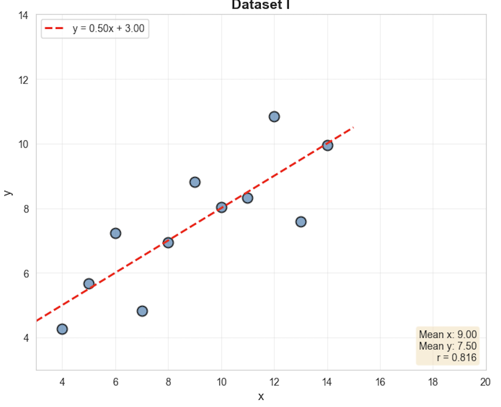
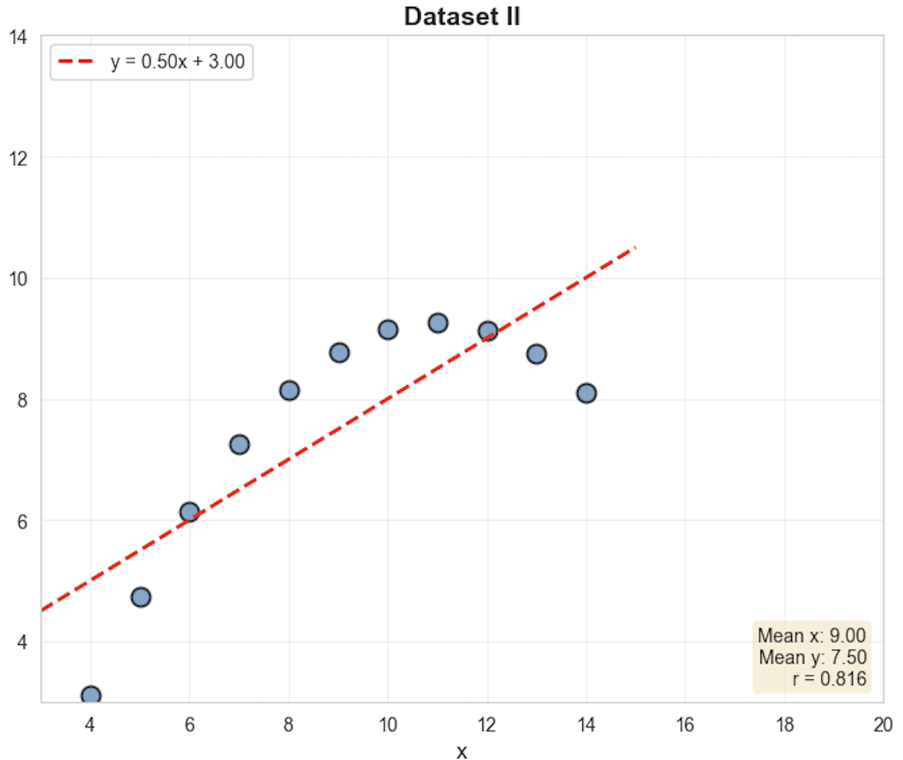
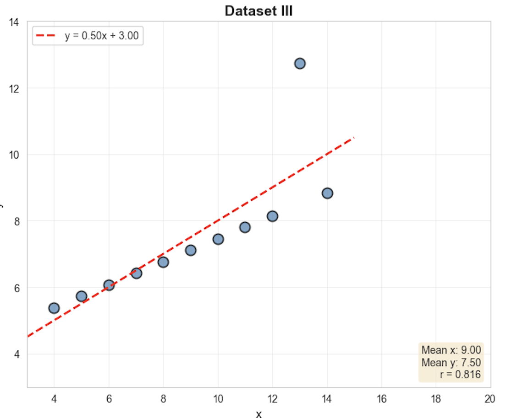
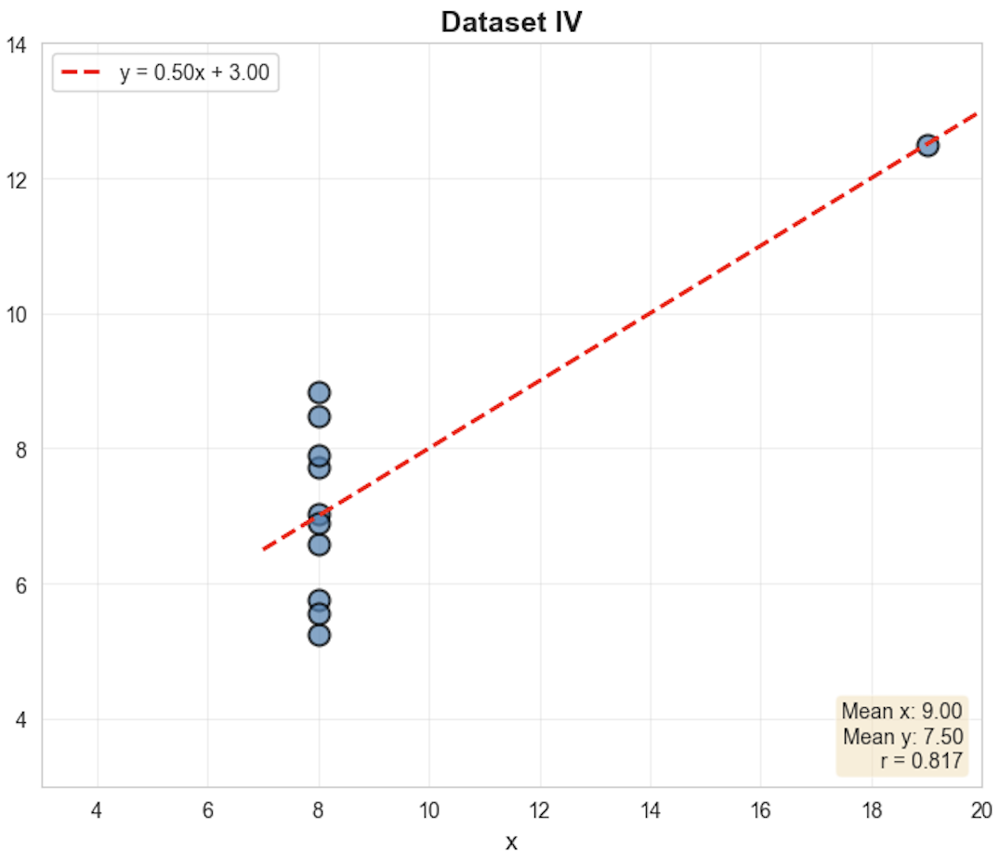

#   Anscombe's Quartet

<!--
⏱️ Slide Timing: 1 min

- Welcome and frame the session: a classic 1973 statistics puzzle with a very modern lesson
- Promise: by the end, everyone will distrust a bare set of summary statistics
- Bridge: start with a setup that looks too good to be true
-->

---

# The Setup: Four "Identical" Datasets
- All four datasets have **exactly the same** statistics:
   - Mean of X: **9.0**
   - Mean of Y: **7.5**
   - Standard deviation of X: **3.3**
   - Standard deviation of Y: **2.0**
   - Correlation: **0.816**
   - Linear regression: **y = 0.5x + 3.0**

> **Question:** If the statistics are identical, are the datasets the same?

<!--
⏱️ Slide Timing: 3 min

- Statistician Francis Anscombe built these four datasets in 1973 specifically to make this point
- Every summary number a regression report would show you matches, exactly, across all four
- Ask the audience to hold their answer to the blockquote question — the next slide reveals it
❓ Ask: "Based on these six matching statistics, would you expect these four datasets to look the same on a chart?"
-->

---

# The Reality: Four Completely Different Stories

**Always visualize your data!**

<!--
⏱️ Slide Timing: 4 min

- Reveal: identical statistics, four wildly different shapes
- Point out each quadrant briefly — clean line, curve, outlier-driven line, vertical cluster with one flier
- This single image is the entire argument for the rest of the deck — everything after is elaboration
-->

---

# Dataset I: The "Good" One

- **Pattern:** Simple linear relationship with random scatter

- **What it means:**
   - Linear regression is appropriate
   - Predictions will be reasonably accurate
   - This is what we *hope* our data looks like

- **Takeaway:** Even perfect scenarios have variance!

<!--
⏱️ Slide Timing: 3 min

- This is the textbook case — the one every stats course example secretly assumes
- Real scatter around the line is normal and expected, not a sign anything is wrong
- Worth noting: even here, no individual point sits exactly on the regression line
-->

---

# Dataset II: The Curved One

- **Pattern:** Clear non-linear (quadratic) relationship

- **The Problem:**
   - Linear model makes **systematic errors**
   - Underestimates at edges, overestimates in middle
   - U-shaped residual pattern (red flag!)

- **The Fix:**
   - Use polynomial or non-linear regression
   - R² = 0.67 looks "good" but model is **wrong**

<!--
⏱️ Slide Timing: 4 min

- Analogy: fitting a straight ruler to a rainbow — it touches at a couple points, misses everywhere else
- The danger here is subtle because the fit still "looks" reasonable on a summary printout
- Foreshadow the residual-plot lesson later in the deck — this is exactly the case it's designed to catch
-->

---
# Dataset III: The Outlier

- **Pattern:** Perfect linear... except ONE point

- **The Problem:**
   - Single outlier drastically affects the regression line
   - Rest of data follows a different pattern
   - Outlier has high **leverage** (unusual x-value)

- **Questions to Ask:**
   - Is this a data error?
   - Is this a special case to investigate?
   - Should we use robust regression?

<!--
⏱️ Slide Timing: 4 min

- Without that one point, this dataset is a near-perfect line — the outlier is doing all the damage
- Real-world example: a sensor misread, a fat-fingered data entry, or a genuinely unusual event worth studying
- Key discipline: investigate before you delete — the outlier could be the most informative row in the table
-->

---

# Dataset IV: The Most Dangerous

- **Pattern:** NO relationship exists!

- **The Illusion:**
   - 10/11 points have x = 8 (no variance!)
   - ONE outlier at x = 19 creates fake correlation
   - Remove it → correlation drops to ~0

- **Real-World Impact:**
   - Would conclude "X predicts Y" when it doesn't
   - Business decisions based on false relationships
   - Potentially catastrophic outcomes

<!--
⏱️ Slide Timing: 4 min

- Ten of eleven points carry zero information about the x-y relationship — one point manufactures the entire correlation
- This is the most dangerous pattern of the four because the regression output gives no visible warning
- Practical test: does the conclusion survive if that single point is removed? If not, don't trust it
-->

---

# The Business Scenario

- **Imagine:** Y = Sales, X = Ad Spend
- **Dataset II** (non-linear):
   - Wrong model → wrong budget allocation
   - Miss optimal spending levels
- **Dataset IV** (outlier-driven):
   - Believe ads drive sales when they don't!
   - Waste millions on ineffective campaigns
   - Miss actual drivers of sales

- **Cost:** Potentially millions in poor decisions

<!--
⏱️ Slide Timing: 4 min

- Translate the abstract math into a boardroom decision: same broken statistics, real budget on the line
- Dataset II failure mode: overspending past the point of diminishing returns because the model assumed linearity
- Dataset IV failure mode: a lucky quarter with one big campaign gets mistaken for a durable trend
-->

---

# Lesson 1: Summary Statistics Lie

- **Same numbers can tell completely different stories**

   - Mean, std dev, correlation can be identical
   - Yet underlying data is fundamentally different
   - Numbers without context are dangerous

- **Golden Rule:** Never trust statistics alone

<!--
⏱️ Slide Timing: 2 min

- Transition slide — moving from "here's the puzzle" to "here's what to do about it"
- Six lessons follow, each one a direct, actionable takeaway from what was just shown
-->

---

# Lesson 2: Visualization is Non-Negotiable

- **Visualization reveals what statistics hide:**
   - Non-linear relationships
   - Outliers and anomalies
   - Clusters and groupings
   - Data quality issues
   - Violations of assumptions

- **Best Practice:** Plot first, model second

<!--
⏱️ Slide Timing: 2 min

- A scatter plot takes seconds to make and catches problems no summary table will surface
- Encourage a habit: never run a regression on data that hasn't been plotted first
-->

---

# Lesson 3: Check Your Assumptions

- Linear regression assumes:
   1. **Linearity** - relationship is actually linear
   2. **Independence** - observations are independent
   3. **Homoscedasticity** - constant variance
   4. **Normality** - residuals are normally distributed
   5. **No outliers** - or at least account for them

- **If assumptions fail, your predictions fail**

<!--
⏱️ Slide Timing: 3 min

- These five assumptions are the fine print behind every linear regression coefficient
- Dataset II broke linearity, Dataset III and IV broke the outlier assumption — same model, different failure modes
- Not all violations are fatal, but each one should be checked and reported, not assumed away
-->

---

# Lesson 4: Residual Plots Are Your Friend

- **Good residual plot:**
   - Random scatter around zero
   - No patterns or trends
   - Constant spread

- **Bad residual plots reveal:**
   - U-shape → non-linear relationship (Dataset II)
   - Funnel shape → heteroscedasticity
   - Clusters → missing variables
   - Outliers → special cases

<!--
⏱️ Slide Timing: 3 min

- Residual plots are the diagnostic tool that would have caught Dataset II immediately, even without seeing the scatter plot
- Rule of thumb: if you can see a shape in the residuals, the model is missing something

> heteroscedasticity - spread of data points is not the same every where
-->

---

# Lesson 5: One Outlier Can Ruin Everything

- **High leverage points** (unusual x-values) have outsized influence:
   - Can create relationships that don't exist
   - Can hide relationships that do exist
   - Can dramatically change model parameters

- **What to do:**
   1. **Investigate** - Why is this point different?
   2. **Don't auto-delete** - It might be your most important finding!
   3. **Consider robust methods** - Less sensitive to outliers
   4. **Report sensitivity** - How much does model change?

<!--
⏱️ Slide Timing: 3 min

- Leverage differs from a simple large residual — it's about how unusual the x-value is, not just how far off the prediction is
- The "don't auto-delete" rule matters most in fraud detection and anomaly work, where the outlier is often the whole point
-->

---
# Lesson 6: Good Metrics ≠ Good Model

- **Dataset II:** R² = 0.67 (looks decent!)
   - But model is **fundamentally wrong**
   - Systematic prediction errors
   - Choosing wrong model type

- **Dataset IV:** R² = 0.67 (looks decent!)
   - But relationship is **completely false**
   - Driven by single outlier
   - Would make terrible predictions

- **Beware:** Metrics can be misleading without context

<!--
⏱️ Slide Timing: 3 min

- Ties the whole deck together: identical R² across all four datasets, radically different reliability
- A single metric is a compression of the data — and compression always loses information
-->

---

# Best Practices
1. Visualize First
2. Explore & Understand
3. State Assumptions
4. Build Model
5. Diagnostic Checks (residuals, outliers)
6. Validate on New Data
7. Maintain Skepticism!

<!--
⏱️ Slide Timing: 2 min

- This is the workflow version of everything covered so far — a checklist to run before trusting any model
- Step 7 is deliberately last: skepticism should persist even after a model passes every earlier check
-->

---

# Real-World Applications

- **Dataset II (Non-linear):**
   - Returns diminishing over scale
   - Learning curves, dose-response
   - Economic relationships

- **Dataset III (Outlier):**
   - Rare events or anomalies
   - Data entry errors
   - Special cases worth studying

- **Dataset IV (False correlation):**
   - Confounding variables
   - Spurious relationships
   - Small sample sizes

<!--
⏱️ Slide Timing: 3 min

- Grounding the four abstract patterns in domains the audience will recognize
- Dose-response curves in medicine are a classic Dataset II case; fraud detection often lives in Dataset III territory
-->

---

## Common Mistakes to Avoid

- Reporting only R² without visualizing
- Deleting outliers without investigation
- Assuming linearity without checking
- Ignoring residual patterns
- Using models on data they weren't built for
- Trusting a model just because it has "good" metrics
- Forgetting to validate on new data

<!--
⏱️ Slide Timing: 2 min

- This list doubles as a code-review checklist for anyone signing off on someone else's regression work
- Every item on this list is a mistake that Anscombe's Quartet, by construction, would sail right through
-->

---

## What Makes a Good Data Scientist?

- **Technical Skills:**
   - Know your statistical methods
   - Understand assumptions and limitations
   - Use diagnostic tools effectively

- **Critical Thinking:**
   - Question the data and results
   - Look for what might be wrong
   - Don't fall in love with your models

- **Communication:**
   - Visualize to explain
   - Acknowledge uncertainty
   - Document assumptions

<!--
⏱️ Slide Timing: 3 min

- Technical skill alone would not have caught these four datasets — critical thinking and communication close the gap
- "Don't fall in love with your models" is worth repeating out loud — it's the hardest habit on this slide to build
-->

---

# The Anscombe's Quartet Mindset

> "The greatest value of a picture is when it forces us to notice what we never expected to see."
> — John Tukey

> Every dataset is guilty until proven innocent by visualization

<!--
⏱️ Slide Timing: 2 min

- Tukey and Anscombe were contemporaries — this quote could have been written about this exact dataset
- Land the "guilty until proven innocent" framing as the one-line mental model to carry forward
-->

---

# Key Takeaway

- In data science, seeing is believing
- Summary statistics are never enough
- Always **Visualize** your data

<!--
⏱️ Slide Timing: 1 min

- Closing summary before references — the three lines here are the entire deck compressed
- If nothing else survives from this session, this slide should
-->

---

# Video

- [Same Stats, Different Graphs](https://www.youtube.com/watch?v=DbJyPELmhJc)

<!--
⏱️ Slide Timing: 1 min

- Good slide to share on-screen for anyone who wants the visual recap after the session
- Worth revisiting before presenting any regression result to a non-technical audience
-->

---

# References

| Topic | Source |
|-------|--------|
| **Anscombe (1973)** | Anscombe, F. J. (1973). [Graphs in Statistical Analysis](https://www.tandfonline.com/doi/abs/10.1080/00031305.1973.10478966). *The American Statistician*, 27(1), 17–21. |
| **Tukey (1977)** | Tukey, J. W. (1977). *Exploratory Data Analysis*. Addison-Wesley. |

<!--
⏱️ Slide Timing: 1 min

- Anscombe (1973) is the primary source — worth bookmarking for anyone who wants the original four-dataset construction
- Tukey (1977) is the broader philosophical grounding for "always plot first"
-->
