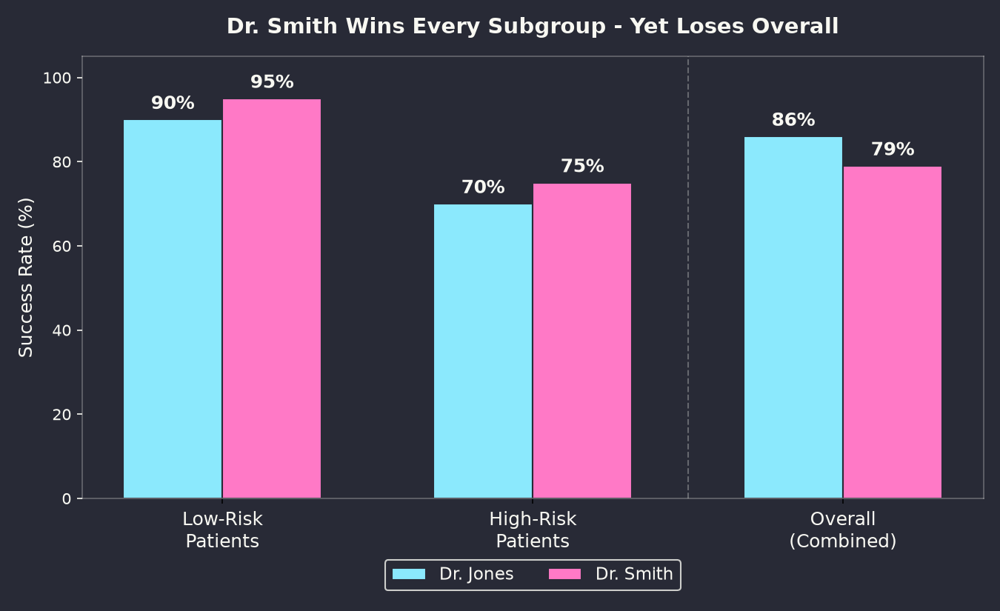
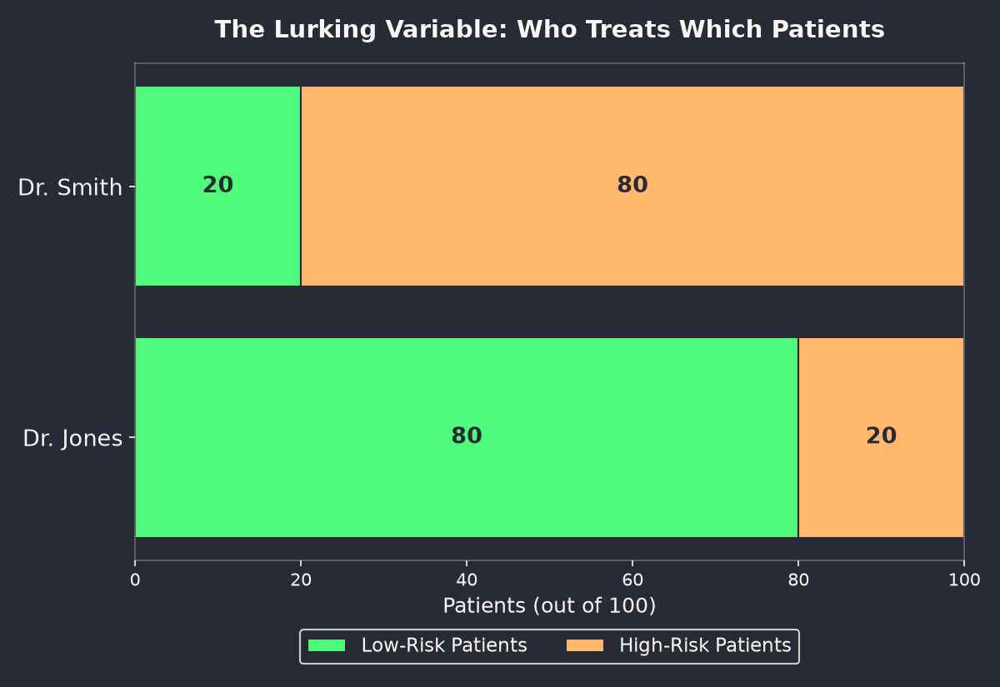
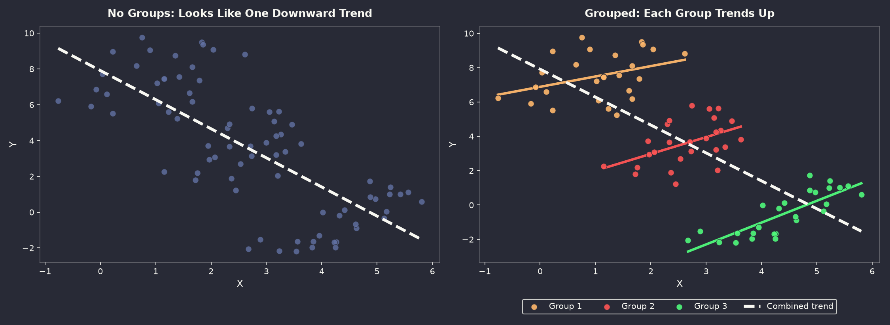

#     Simpson's Paradox

<!--
⏱️ Slide Timing: 1 min

- Welcome and frame the session: a data paradox that can quietly flip life-or-death decisions
- Promise: by the end, everyone will know to ask "what's hiding inside this average?"
- Bridge: open with a scenario that feels like an easy, obvious choice
-->

---

# The Setup: Choosing a Surgeon
- Imagine you need surgery and compare two doctors' track records:
   - **Dr. Jones:** 86% overall success rate
   - **Dr. Smith:** 79% overall success rate
- The numbers seem to make the choice for you

> **Question:** Is picking the doctor with the higher success rate always the rational choice?

<!--
⏱️ Slide Timing: 2 min

- Anchor the audience in a relatable, high-stakes decision — nobody picks a surgeon casually
- 86% vs 79% looks like a 7-point gap, which feels decisive
- Hold the blockquote question — the next slides will overturn the obvious answer
❓ Ask: "Based on these two numbers alone, who would you pick?"
-->

---

# Watch: Simpson's Paradox Explained

- The surgeon example and worked math in this deck are drawn from this video
- [Simpson's Paradox: Why More Data Can Trick You](https://www.youtube.com/watch?v=vdaNwjlAq9M)

<!--
⏱️ Slide Timing: 1 min

- Good slide to leave on screen for anyone who wants to rewatch the walkthrough after the session
- Worth sharing before any team presents an aggregate metric to leadership
-->

---

# Digging Deeper: Split by Patient Risk
- Ask the hospital for outcomes broken down by patient type
- **High-risk patients:**
   - Dr. Smith: **75%** success
   - Dr. Jones: **70%** success
- **Low-risk patients:**
   - Dr. Smith: **95%** success
   - Dr. Jones: **90%** success
- Dr. Smith wins **both** subgroups — yet loses overall

<!--
⏱️ Slide Timing: 3 min

- The reveal: Smith is better with the hard cases AND the easy cases
- This is the moment that should feel logically impossible — flag it explicitly
- Let the contradiction sit for a beat before explaining it on the next slide
-->

---

# The Numbers, Visualized

<!--
⏱️ Slide Timing: 3 min

- Same data as the last slide, now side by side — the pink bars (Smith) beat the blue bars (Jones) in both subgroups
- Then the rightmost pair flips: Jones's overall bar is taller than Smith's
- This single chart is the entire paradox in one image — everything after explains why it happens
-->

---

# How Is This Possible? The Caseload Mix

<!--
⏱️ Slide Timing: 4 min

- Dr. Smith is a specialist — 80 of her last 100 patients were high-risk cases
- Dr. Jones handles mostly routine surgery — 80 of his last 100 patients were low-risk
- The two doctors aren't being compared on the same mix of cases at all
-->

---

# Doing the Math: Weighted Averages

**Dr. Smith (20 low-risk, 80 high-risk)**
- Low-risk: 20 × 95% = **19** survivors
- High-risk: 80 × 75% = **60** survivors
- Total: 79 / 100 = **79%**

**Dr. Jones (80 low-risk, 20 high-risk)**
- Low-risk: 80 × 90% = **72** survivors
- High-risk: 20 × 70% = **14** survivors
- Total: 86 / 100 = **86%**

<!--
⏱️ Slide Timing: 4 min

- Walk through the arithmetic slowly — this is the "aha" slide where the paradox stops feeling magical
- Jones's overall number is pulled up by a large, easy caseload, not superior skill
- Smith's overall number is pulled down by a large, difficult caseload, not inferior skill
-->

---

# Naming the Phenomenon
- **Simpson's Paradox:** 
    - a trend appears in several groups of data 
        - but disappears or reverses when the groups are combined
- Variables can be **positively correlated** within every subgroup 
    - yet **negatively correlated** in aggregate
- The overall number told you to pick Jones
- The subgroup breakdown says Smith is the better choice, 
    - **for either kind of patient**

<!--
⏱️ Slide Timing: 3 min

- Formal definition, now that the audience has already felt the paradox firsthand
- Emphasize: this isn't a rare edge case — it's a structural risk in any aggregated comparison
- The named phenomenon dates to statistician Edward Simpson's 1951 paper, though the effect was noted earlier by others including Karl Pearson
-->

---

# Trend Reversal, Visualized

- **Left:** no group labels — looks like one clean downward trend
- **Right:** same data, colored by group — each group actually trends **upward**
- No single point moved — only whether the grouping was visible

<!--
⏱️ Slide Timing: 3 min

- This is the general shape of Simpson's Paradox beyond the surgeon example — it applies to any X-Y relationship, not just success rates
- Left panel is what a naive analysis sees; right panel is what stratifying by group reveals — same data, opposite conclusion
- The mechanism is the same as the surgeon case: groups differ in their typical X position, and that positioning — not the true within-group relationship — dominates the aggregate
-->

---

# The Lurking Variable
- A **lurking (confounding) variable** is a hidden factor 
    - that changes what the data appears to say
- In this example: 
    - it is the **proportion of high-risk vs. low-risk patients** each surgeon treats
    - It's correlated with:
        - The **outcome** (high-risk patients survive less often, regardless of surgeon)
        - The **group** being compared (Smith sees far more high-risk cases)
    - Ignore it, and the aggregate comparison is comparing apples to oranges

<!--
⏱️ Slide Timing: 3 min

- This slide is the conceptual core — everything else in the deck is an application of this one idea
- A lurking variable doesn't have to be exotic — patient mix, timing, sample size, or geography are common culprits
- Rule of thumb: whenever you compare rates across groups, ask what else differs between those groups
-->

---

# Real-World Case: Hospital Rankings
- Major referral centers and trauma hospitals 
    - often look **worse** on raw survival-rate rankings
- Reason: 
    - they take the sickest, most complex patients that smaller hospitals decline to treat
- Once outcomes are **risk-adjusted** for patient severity, 
    - top referral centers frequently rank at the top
- Raw league tables can punish the hospitals doing the hardest, most valuable work
> Source: Krumholz et al. (2006), risk-standardized mortality methodology — see References

<!--
⏱️ Slide Timing: 3 min

- Direct real-world echo of the surgeon example, now at institutional scale
- This is why healthcare quality metrics increasingly report "risk-adjusted mortality," not raw mortality
- Ties back to policy: a naive public ranking could steer patients away from the centers best equipped to save them
-->

---

# Real-World Case: Clinical Trials
- A new treatment can look **weaker overall** than a control or existing treatment
- But the same treatment can **outperform** 
    - once you stratify by disease severity or baseline risk
- Cause: 
    - sicker patients may be disproportionately assigned to (or seek out) the new treatment
- Trial design and analysis must account for this
    - via **stratification** or **randomization checks**
> Classic case: Charig et al. (1986) kidney stone treatment trial — see References

<!--
⏱️ Slide Timing: 3 min

- Clinical trials guard against this with randomization, but observational and post-hoc analyses are especially vulnerable
- A treatment that "failed" in aggregate results might still be the right choice for a specific risk group
- Regulatory reviewers specifically look for subgroup reversals like this during drug approval review
-->

---

# Real-World Case: UC Berkeley Admissions (1973)
- Berkeley's graduate admissions showed an aggregate gap: 
    - **44%** of male applicants admitted vs. **35%** of female applicants
- This looked like evidence of bias against women applicants
- Broken down **by department**, 
    - most departments showed **no bias** — some even favored women slightly
- Explanation: 
    - women applied in greater numbers to more competitive departments 
        - with **lower overall admit rates**
> Source: Bickel, Hammel & O'Connell (1975), Science — see References

<!--
⏱️ Slide Timing: 4 min

- One of the most famous real applications of Simpson's Paradox, published by Bickel, Hammel & O'Connell in Science (1975)
- The lurking variable here is choice of department, not applicant sex — competitive departments admit fewer applicants of any gender
- Important nuance to state clearly: this doesn't prove there was zero bias anywhere in the system, just that the aggregate number alone was misleading as evidence
❓ Ask: "If you only saw the aggregate 44% vs 35% figures, what would you have concluded?"
-->

---

# Lesson 1: Aggregates Can Deceive
- A single overall number can **completely reverse** the story told by its subgroups
- This isn't rare — it shows up in medicine, admissions, sports, sales, and A/B tests
- **Golden Rule:** an aggregate statistic is a starting question, not a final answer

<!--
⏱️ Slide Timing: 2 min

- Transition slide — moving from "here's the paradox" to "here's what to do about it"
- Four lessons follow, each a direct, actionable takeaway for working with grouped data
-->

---

# Lesson 2: Always Look for Subgroups
- Before trusting an aggregate comparison, ask:
   - What natural subgroups exist in this data?
   - Are those subgroups distributed **unevenly** across the things being compared?
   - Does splitting by subgroup change — or reverse — the conclusion?
- **Best Practice:** stratify first, aggregate second

<!--
⏱️ Slide Timing: 3 min

- This is the practical checklist version of the lurking-variable concept
- Encourage a habit: whenever a metric compares two groups (doctors, campaigns, cohorts), ask what's unevenly distributed underneath it
- Segment size matters too — check that subgroup sample sizes are large enough to trust
-->

---

# Lesson 3: Weighted Averages, Not Simple Averages
- An overall rate is a **weighted average** of subgroup rates, weighted by group size
- A group with a **large, easy** subset can post a high overall number without being the best performer
- A group with a **large, hard** subset can post a low overall number despite being the best performer
- Always ask: 
    - what are the weights, 
    - and are they the same across what I'm comparing?

<!--
⏱️ Slide Timing: 3 min

- This is the arithmetic intuition to carry forward — reconnect explicitly to the surgeon math slide
- Same logic explains skewed batting averages, uneven A/B test traffic splits, and biased survey aggregates
- Rule of thumb: if the group weights differ, the aggregate comparison is not apples-to-apples
-->

---

# Lesson 4: When Aggregation Is (and Isn't) Valid
- **Aggregation is valid when:**
   - Subgroup composition is similar across the groups being compared
   - Or subgroup effects point in the same direction and are of similar size
- **Aggregation is misleading when:**
   - Groups differ heavily in subgroup composition (like caseload mix here)
   - A lurking variable correlates with both the outcome and the grouping
- **When in doubt:** report both the aggregate and the stratified breakdown

<!--
⏱️ Slide Timing: 3 min

- Not every aggregate is broken — this slide prevents the audience from over-correcting into "never trust an average"
- The test is simple: do the subgroup weights match? If yes, aggregation is safe
- Reporting both views costs little and builds trust with stakeholders who might otherwise be misled
-->

---

# Best Practices Checklist
1. Identify plausible confounding or lurking variables
2. Stratify the data before trusting an aggregate comparison
3. Compute both aggregate and subgroup rates
4. Check subgroup weights — are they even across groups?
5. Investigate any reversal between subgroup and aggregate trends
6. Report risk-adjusted or stratified metrics alongside raw ones
7. Stay skeptical of any single summary number

<!--
⏱️ Slide Timing: 2 min

- Workflow version of everything covered in the lessons — a checklist to run before presenting any comparative metric
- Step 7 is deliberately last: skepticism should persist even after subgroup checks pass
-->

---

# Common Mistakes to Avoid
- Ranking people, teams, or hospitals on raw aggregate rates alone
- Assuming a group difference implies causation without checking confounders
- Ignoring uneven sample sizes or uneven subgroup composition
- Treating a subgroup reversal as a data error instead of investigating it
- Reporting one blended metric when stakeholders need the stratified view

<!--
⏱️ Slide Timing: 2 min

- This list doubles as a review checklist for anyone signing off on a comparative report or dashboard
- Every item here is a mistake the surgeon example, by construction, would sail right through undetected
-->

---

# Key Takeaway

- The aggregate number is never the whole story
- Always ask what's hiding underneath the average: 
    - a lurking variable, 
    - an uneven mix, 
    - a hidden group
> Sometimes the better choice looks worse on paper

<!--
⏱️ Slide Timing: 1 min

- Closing summary before references — the three lines here compress the entire deck
- If nothing else survives from this session, this slide should
-->

---

# References

| Topic | Source |
|-------|--------|
| **Simpson (1951)** | Simpson, E. H. (1951). [The Interpretation of Interaction in Contingency Tables](https://www.jstor.org/stable/2984065). *Journal of the Royal Statistical Society: Series B*, 13(2), 238–241. |
| **Bickel, Hammel & O'Connell (1975)** | Bickel, P. J., Hammel, E. A., & O'Connell, J. W. (1975). [Sex Bias in Graduate Admissions: Data from Berkeley](https://www.science.org/doi/10.1126/science.187.4175.398). *Science*, 187(4175), 398–404. |
| **Charig et al. (1986)** | Charig, C. R., Webb, D. R., Payne, S. R., & Wickham, J. E. A. (1986). [Comparison of Treatment of Renal Calculi by Open Surgery, Percutaneous Nephrolithotomy, and Extracorporeal Shockwave Lithotripsy](https://www.bmj.com/content/292/6524/879). *British Medical Journal*, 292(6524), 879–882. |
| **Krumholz et al. (2006)** | Krumholz, H. M., Wang, Y., Mattera, J. A., et al. (2006). [An Administrative Claims Model Suitable for Profiling Hospital Performance Based on 30-Day Mortality Rates Among Patients With Heart Failure](https://www.ahajournals.org/doi/10.1161/CIRCULATIONAHA.105.611194). *Circulation*, 113(13), 1693–1701. |
| **Pearl (2014)** | Pearl, J. (2014). [Understanding Simpson's Paradox](https://ftp.cs.ucla.edu/pub/stat_ser/r414.pdf). *The American Statistician*, 68(1), 8–13. |

<!--
⏱️ Slide Timing: 1 min

- Simpson (1951) is the formal statistical origin, though the pattern was observed earlier by Pearson and Yule
- Charig et al. (1986) is the classic kidney-stone treatment case, textbook example of Simpson's Paradox in a clinical trial
- Krumholz et al. (2006) underlies the risk-standardized mortality methodology CMS uses for hospital rankings
- Bickel, Hammel & O'Connell (1975) is the canonical UC Berkeley case study referenced earlier in the deck
- Pearl (2014) gives a modern causal-inference framing of why and when the paradox occurs — worth bookmarking for deeper study
-->
